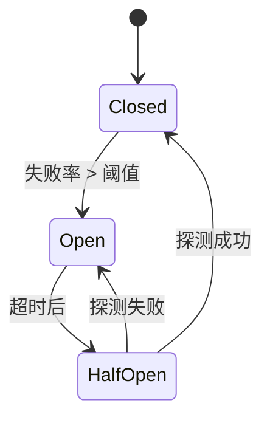

# Breaker 熔断器设计文档

## 1. 目标与原则

`breaker` 旨在为 Genesis 框架提供一个轻量级、高性能的熔断器组件，专注于 gRPC 客户端的故障隔离与自动恢复。

**设计原则：**

1. **故障隔离 (Fault Isolation):** 当下游服务频繁失败时，自动熔断请求，避免级联故障和资源浪费。
2. **自动恢复 (Auto Recovery):** 通过半开状态定期探测，在下游服务恢复后自动闭合熔断器。
3. **轻量化 (Lightweight):** 单机模式，基于内存统计，无外部依赖，启动快、性能高。
4. **服务级粒度 (Service-Level Granularity):** 按目标服务名熔断，不同服务独立管理，互不影响。
5. **灵活降级 (Flexible Fallback):** 支持直接快速失败和自定义降级逻辑两种策略。
6. **无侵入集成 (Non-intrusive):** 提供 gRPC Interceptor，业务代码无需修改即可接入熔断保护。

## 2. 项目结构

遵循框架整体的分层设计，API 与实现分离：

```text
genesis/
├── pkg/
│   └── breaker/                # 公开 API 入口
│       ├── breaker.go          # 工厂函数 (New) + 类型导出
│       ├── options.go          # Option 定义 (WithLogger, WithMeter)
│       ├── adapter/            # 适配器
│       │   └── grpc.go         # gRPC Client Interceptor
│       └── types/              # 类型定义
│           ├── interface.go    # Breaker 接口
│           ├── config.go       # 配置定义
│           └── errors.go       # 错误定义
├── internal/
│   └── breaker/                # 内部实现
│       └── breaker.go          # 状态机与滑动窗口实现
└── ...
```

## 3. 核心 API 设计

核心定义位于 `pkg/breaker/types/`。

### 3.1. Breaker 接口

```go
// pkg/breaker/types/interface.go

package types

import (
    "context"
)

// State 熔断器状态
type State string

const (
    StateClosed   State = "closed"    // 正常状态，请求正常通过
    StateOpen     State = "open"      // 熔断状态，请求快速失败
    StateHalfOpen State = "half_open" // 半开状态，允许少量探测请求
)

// Breaker 熔断器核心接口
type Breaker interface {
    // Execute 执行受保护的函数
    // key: 服务标识（如 "user.v1.UserService"）
    // fn: 实际业务逻辑
    // 返回: 业务逻辑的 error，或熔断器错误 ErrOpenState
    Execute(ctx context.Context, key string, fn func() error) error

    // ExecuteWithFallback 执行受保护的函数，并提供降级逻辑
    // key: 服务标识
    // fn: 实际业务逻辑
    // fallback: 熔断时的降级函数，接收原始错误，返回降级结果的错误
    ExecuteWithFallback(ctx context.Context, key string, fn func() error, fallback func(error) error) error

    // State 获取指定服务的熔断器状态
    State(key string) State

    // Reset 手动重置指定服务的熔断器状态为 Closed
    // 用于运维场景的强制恢复
    Reset(key string)
}
```

### 3.2. 配置 (Config)

```go
// pkg/breaker/types/config.go

package types

import "time"

// Config 熔断器组件配置
type Config struct {
    // Default 默认策略（应用到所有未单独配置的服务）
    Default Policy `yaml:"default" json:"default"`

    // Services 按服务名配置不同的策略（可选）
    // Key 为服务名（如 "user.v1.UserService"）
    Services map[string]Policy `yaml:"services" json:"services"`
}

// Policy 熔断策略
type Policy struct {
    // FailureThreshold 失败率阈值 (0.0-1.0)
    // 当失败率超过此值时触发熔断
    // 默认: 0.5 (50%)
    FailureThreshold float64 `yaml:"failure_threshold" json:"failure_threshold"`

    // WindowSize 滑动窗口大小（统计最近 N 次请求）
    // 默认: 100
    WindowSize int `yaml:"window_size" json:"window_size"`

    // MinRequests 最小请求数
    // 在窗口内请求数未达到此值前，不触发熔断判断
    // 默认: 10
    MinRequests int `yaml:"min_requests" json:"min_requests"`

    // OpenTimeout 熔断持续时间
    // 熔断器进入 Open 状态后，等待此时间后转为 HalfOpen
    // 默认: 30s
    OpenTimeout time.Duration `yaml:"open_timeout" json:"open_timeout"`

    // HalfOpenMaxRequests 半开状态允许的最大探测请求数
    // 默认: 3
    HalfOpenMaxRequests int `yaml:"half_open_max_requests" json:"half_open_max_requests"`

    // CountTimeout 是否将超时也计入失败统计
    // 默认: false (仅统计明确的错误，如 codes.Unavailable)
    CountTimeout bool `yaml:"count_timeout" json:"count_timeout"`
}

// DefaultPolicy 返回默认策略
func DefaultPolicy() Policy {
    return Policy{
        FailureThreshold:    0.5,
        WindowSize:          100,
        MinRequests:         10,
        OpenTimeout:         30 * time.Second,
        HalfOpenMaxRequests: 3,
        CountTimeout:        false,
    }
}
```

### 3.3. 错误定义

```go
// pkg/breaker/types/errors.go

package types

import "errors"

var (
    // ErrOpenState 熔断器处于 Open 状态，请求被拒绝
    ErrOpenState = errors.New("circuit breaker is open")

    // ErrTooManyRequests 半开状态下探测请求数已达上限
    ErrTooManyRequests = errors.New("too many requests in half-open state")

    // ErrInvalidConfig 配置无效
    ErrInvalidConfig = errors.New("invalid breaker configuration")
)
```

## 4. 内部实现设计

### 4.1. 状态机

熔断器采用经典的三态状态机：



**状态转换规则：**

1. **Closed（正常）:**
   - 所有请求正常通过
   - 统计成功/失败次数
   - 当失败率超过 `FailureThreshold` 且请求数 >= `MinRequests` 时，转为 Open

2. **Open（熔断）:**
   - 所有请求快速失败，返回 `ErrOpenState`
   - 启动定时器，等待 `OpenTimeout` 后转为 HalfOpen

3. **HalfOpen（半开）:**
   - 允许最多 `HalfOpenMaxRequests` 个探测请求通过
   - 如果探测请求成功，转为 Closed 并清空统计
   - 如果探测请求失败，立即转回 Open

### 4.2. 滑动窗口实现

使用**环形缓冲区 (Ring Buffer)** 实现固定大小的滑动窗口：

```go
type Window struct {
    size     int      // 窗口大小
    buffer   []bool   // 环形缓冲区，true=成功，false=失败
    index    int      // 当前写入位置
    total    int      // 总请求数（未满窗口时 < size）
    failures int      // 失败次数
    mu       sync.Mutex
}

func (w *Window) Record(success bool) {
    w.mu.Lock()
    defer w.mu.Unlock()

    // 如果窗口已满，先减去即将被覆盖的值
    if w.total >= w.size && !w.buffer[w.index] {
        w.failures--
    }

    // 写入新值
    w.buffer[w.index] = success
    if !success {
        w.failures++
    }

    // 更新索引和总数
    w.index = (w.index + 1) % w.size
    if w.total < w.size {
        w.total++
    }
}

func (w *Window) FailureRate() float64 {
    w.mu.Lock()
    defer w.mu.Unlock()

    if w.total == 0 {
        return 0
    }
    return float64(w.failures) / float64(w.total)
}
```

### 4.3. 熔断器实例管理

使用 `sync.Map` 管理不同服务的熔断器实例：

```go
// internal/breaker/breaker.go

type Manager struct {
    cfg      types.Config
    breakers sync.Map // key: service name, value: *circuitBreaker
    logger   clog.Logger
    meter    telemetry.Meter
    tracer   telemetry.Tracer
}

type circuitBreaker struct {
    policy    types.Policy
    state     types.State
    window    *Window
    openTime  time.Time       // Open 状态开始时间
    halfOpen  atomic.Int32    // HalfOpen 状态下的请求计数器
    mu        sync.RWMutex
}
```

**内存清理（可选）:**

- 启动后台 Goroutine，定期扫描 `sync.Map`
- 删除长时间（如 1 小时）未使用的熔断器实例
- 避免在服务数量极多时的内存泄漏

## 5. gRPC 适配器设计

### 5.1. UnaryClientInterceptor

```go
// pkg/breaker/adapter/grpc.go

package adapter

import (
    "context"
    "google.golang.org/grpc"
    "google.golang.org/grpc/codes"
    "google.golang.org/grpc/status"
    "github.com/ceyewan/genesis/pkg/breaker/types"
)

// UnaryClientInterceptor 创建 gRPC 客户端熔断拦截器
// b: 熔断器实例
// opts: 可选配置
func UnaryClientInterceptor(b types.Breaker, opts ...InterceptorOption) grpc.UnaryClientInterceptor {
    cfg := defaultInterceptorConfig()
    for _, opt := range opts {
        opt(cfg)
    }

    return func(
        ctx context.Context,
        method string,
        req, reply interface{},
        cc *grpc.ClientConn,
        invoker grpc.UnaryInvoker,
        opts ...grpc.CallOption,
    ) error {
        // 1. 从 method 提取服务名
        // 例如: "/user.v1.UserService/GetUser" -> "user.v1.UserService"
        serviceName := extractServiceName(method)

        // 2. 使用熔断器保护
        err := b.Execute(ctx, serviceName, func() error {
            return invoker(ctx, method, req, reply, cc, opts...)
        })

        // 3. 如果是熔断错误，转换为 gRPC 错误码
        if err == types.ErrOpenState {
            return status.Error(codes.Unavailable, "circuit breaker open")
        }

        return err
    }
}

// extractServiceName 从 gRPC Method 提取服务名
// "/user.v1.UserService/GetUser" -> "user.v1.UserService"
func extractServiceName(method string) string {
    // method 格式: /<package>.<service>/<method>
    if len(method) == 0 || method[0] != '/' {
        return method
    }
    
    // 去掉开头的 '/'
    method = method[1:]
    
    // 找到最后一个 '/' 的位置
    if idx := strings.LastIndex(method, "/"); idx != -1 {
        return method[:idx]
    }
    
    return method
}
```

### 5.2. Interceptor 选项

```go
// pkg/breaker/adapter/grpc.go

type interceptorConfig struct {
    // FallbackHandler 全局降级处理器（可选）
    // 当熔断时调用，可返回降级数据
    FallbackHandler func(context.Context, string, error) error
    
    // ShouldCount 自定义判断哪些错误应计入失败
    // 默认: codes.Unavailable, codes.DeadlineExceeded, codes.Internal
    ShouldCount func(error) bool
}

type InterceptorOption func(*interceptorConfig)

// WithFallbackHandler 设置全局降级处理器
func WithFallbackHandler(h func(context.Context, string, error) error) InterceptorOption {
    return func(c *interceptorConfig) {
        c.FallbackHandler = h
    }
}

// WithShouldCount 自定义失败判断逻辑
func WithShouldCount(fn func(error) bool) InterceptorOption {
    return func(c *interceptorConfig) {
        c.ShouldCount = fn
    }
}

func defaultInterceptorConfig() *interceptorConfig {
    return &interceptorConfig{
        ShouldCount: func(err error) bool {
            if err == nil {
                return false
            }
            st, ok := status.FromError(err)
            if !ok {
                return true
            }
            // 只统计这些错误码
            code := st.Code()
            return code == codes.Unavailable ||
                   code == codes.DeadlineExceeded ||
                   code == codes.Internal ||
                   code == codes.Unknown
        },
    }
}
```

## 6. 工厂函数设计

### 6.1. 独立模式工厂函数

```go
// pkg/breaker/breaker.go

package breaker

import (
    "github.com/ceyewan/genesis/pkg/breaker/types"
    "github.com/ceyewan/genesis/pkg/clog"
    internalbreaker "github.com/ceyewan/genesis/internal/breaker"
)

// New 创建熔断器实例
// cfg: 熔断器配置（指针类型，避免拷贝）
// opts: 可选参数 (Logger, Meter, Tracer)
// 注：Breaker 为纯内存组件，无外部依赖（如 Redis/Etcd），因此省略 Dep 参数
func New(cfg *types.Config, opts ...Option) (types.Breaker, error) {
    // 应用选项
    opt := defaultOptions()
    for _, o := range opts {
        o(&opt)
    }

    // 验证配置
    if err := validateConfig(cfg); err != nil {
        return nil, err
    }

    // 调用内部实现
    return internalbreaker.New(cfg, opt.logger, opt.meter, opt.tracer)
}

func validateConfig(cfg *types.Config) error {
    // 验证默认策略
    if err := validatePolicy(&cfg.Default); err != nil {
        return err
    }
    
    // 验证服务级策略
    for name, policy := range cfg.Services {
        if err := validatePolicy(&policy); err != nil {
            return fmt.Errorf("invalid policy for service %s: %w", name, err)
        }
    }
    
    return nil
}

func validatePolicy(p *types.Policy) error {
    if p.FailureThreshold < 0 || p.FailureThreshold > 1 {
        return types.ErrInvalidConfig
    }
    if p.WindowSize <= 0 {
        return types.ErrInvalidConfig
    }
    if p.MinRequests < 0 {
        return types.ErrInvalidConfig
    }
    if p.OpenTimeout <= 0 {
        return types.ErrInvalidConfig
    }
    if p.HalfOpenMaxRequests <= 0 {
        return types.ErrInvalidConfig
    }
    return nil
}
```

### 6.2. Option 模式

```go
// pkg/breaker/options.go

package breaker

import (
    "github.com/ceyewan/genesis/pkg/clog"
    "github.com/ceyewan/genesis/pkg/telemetry/types"
)

type options struct {
    logger clog.Logger
    meter  types.Meter
    tracer types.Tracer
}

type Option func(*options)

// WithLogger 注入日志记录器
// 组件内部会自动追加 "breaker" namespace
func WithLogger(l clog.Logger) Option {
    return func(o *options) {
        if l != nil {
            o.logger = l.WithNamespace("breaker")
        }
    }
}

// WithMeter 注入指标 Meter
func WithMeter(m types.Meter) Option {
    return func(o *options) {
        o.meter = m
    }
}

// WithTracer 注入 Tracer
// 用于记录熔断、降级等关键链路事件
func WithTracer(t types.Tracer) Option {
    return func(o *options) {
        o.tracer = t
    }
}

func defaultOptions() *options {
    return &options{
        logger: clog.Default(),
    }
}
```

## 7. 使用示例

### 7.1. 独立模式使用

```go
package main

import (
    "context"
    "time"

    "github.com/ceyewan/genesis/pkg/breaker"
    "github.com/ceyewan/genesis/pkg/breaker/types"
    "github.com/ceyewan/genesis/pkg/clog"
)

func main() {
    // 1. 创建 Logger
    logger := clog.New(&clog.Config{
        Level:  "info",
        Format: "json",
    })

    // 2. 创建熔断器
    b, err := breaker.New(&types.Config{
        Default: types.Policy{
            FailureThreshold:    0.5,  // 50% 失败率触发熔断
            WindowSize:          100,
            MinRequests:         10,
            OpenTimeout:         30 * time.Second,
            HalfOpenMaxRequests: 3,
        },
        Services: map[string]types.Policy{
            "user.v1.UserService": {
                FailureThreshold: 0.3, // 用户服务更敏感
                WindowSize:       50,
            },
        },
    }, breaker.WithLogger(logger))
    
    if err != nil {
        panic(err)
    }

    ctx := context.Background()

    // 3. 手动使用熔断器
    err = b.Execute(ctx, "user.v1.UserService", func() error {
        // 调用下游服务
        return callUserService()
    })

    if err == types.ErrOpenState {
        logger.Warn("circuit breaker is open, request rejected")
        return
    }

    // 4. 使用降级逻辑
    err = b.ExecuteWithFallback(ctx, "user.v1.UserService",
        func() error {
            return callUserService()
        },
        func(err error) error {
            // 降级逻辑：返回缓存数据
            logger.Info("using fallback data", clog.Error(err))
            return getCachedUserData()
        },
    )
}
```

### 7.2. gRPC Interceptor 集成

```go
package main

import (
    "context"
    "time"

    "google.golang.org/grpc"
    "google.golang.org/grpc/credentials/insecure"

    "github.com/ceyewan/genesis/pkg/breaker"
    "github.com/ceyewan/genesis/pkg/breaker/adapter"
    "github.com/ceyewan/genesis/pkg/breaker/types"
    "github.com/ceyewan/genesis/pkg/clog"
)

func main() {
    logger := clog.New(&clog.Config{Level: "info"})

    // 1. 创建熔断器
    b, _ := breaker.New(&types.Config{
        Default: types.DefaultPolicy(),
    }, breaker.WithLogger(logger))

    // 2. 创建 gRPC 连接，集成熔断拦截器
    conn, err := grpc.Dial(
        "localhost:9090",
        grpc.WithTransportCredentials(insecure.NewCredentials()),
        grpc.WithUnaryInterceptor(
            adapter.UnaryClientInterceptor(b),
        ),
    )
    if err != nil {
        panic(err)
    }
    defer conn.Close()

    // 3. 正常使用 gRPC 客户端
    // 熔断保护已自动生效
    client := pb.NewUserServiceClient(conn)
    resp, err := client.GetUser(context.Background(), &pb.GetUserRequest{
        Id: "123",
    })
    
    if err != nil {
        logger.Error("failed to call GetUser", clog.Error(err))
        return
    }
    
    logger.Info("got user", clog.String("name", resp.Name))
}
```

### 7.3. 带全局降级的 Interceptor

```go
// 创建带降级处理的拦截器
conn, _ := grpc.Dial(
    target,
    grpc.WithUnaryInterceptor(
        adapter.UnaryClientInterceptor(b,
            adapter.WithFallbackHandler(func(ctx context.Context, method string, err error) error {
                logger.Warn("circuit breaker triggered, using fallback",
                    clog.String("method", method),
                    clog.Error(err))
                
                // 根据方法返回不同的降级数据
                switch {
                case strings.Contains(method, "GetUser"):
                    return getCachedUser(ctx)
                case strings.Contains(method, "ListOrders"):
                    return getEmptyOrderList(ctx)
                default:
                    return err
                }
            }),
        ),
    ),
)
```

### 7.4. 容器模式集成（可选）

如果需要通过 Container 管理，可在 `AppConfig` 中添加配置：

```yaml
# config.yaml
components:
  breaker:
    default:
      failure_threshold: 0.5
      window_size: 100
      min_requests: 10
      open_timeout: 30s
      half_open_max_requests: 3
    services:
      user.v1.UserService:
        failure_threshold: 0.3
        window_size: 50
```

Container 初始化代码：

```go
// pkg/container/container.go

func (c *Container) initBreaker(cfg *types.Config) error {
    b, err := breaker.New(cfg.Breaker,
        breaker.WithLogger(c.Logger),
        breaker.WithMeter(c.Meter),
    )
    if err != nil {
        return err
    }

    c.Breaker = b
    return nil
}
```

## 8. 可观测性

### 8.1. 日志

组件在关键状态变化时记录日志：

```go
// 状态转换
logger.Info("circuit breaker state changed",
    clog.String("service", serviceName),
    clog.String("from", oldState),
    clog.String("to", newState),
    clog.Float64("failure_rate", failureRate))

// 熔断触发
logger.Warn("circuit breaker opened",
    clog.String("service", serviceName),
    clog.Int("total_requests", total),
    clog.Int("failed_requests", failures),
    clog.Float64("failure_rate", failureRate))
```

### 8.2. Metrics

建议暴露以下指标：

```go
// 熔断器状态 (0=Closed, 1=Open, 2=HalfOpen)
breaker_state{service="user.v1.UserService"} 0

// 请求总数
breaker_requests_total{service="user.v1.UserService",result="success|failure"} 1000

// 失败率
breaker_failure_rate{service="user.v1.UserService"} 0.05

// 熔断次数
breaker_open_total{service="user.v1.UserService"} 3
```

### 8.3. Tracing

在关键操作中记录 Span 事件：

```go
// 熔断拒绝请求时
span.AddEvent("circuit_breaker.rejected", trace.WithAttributes(
    attribute.String("service", serviceName),
    attribute.String("state", "open"),
))

// 降级处理时
span.AddEvent("circuit_breaker.fallback", trace.WithAttributes(
    attribute.String("service", serviceName),
    attribute.String("reason", err.Error()),
))

// 状态转换时
span.AddEvent("circuit_breaker.state_changed", trace.WithAttributes(
    attribute.String("service", serviceName),
    attribute.String("from", oldState),
    attribute.String("to", newState),
))
```

## 9. 与现有组件的一致性对比

| 维度 | ratelimit | idempotency | breaker |
|------|-----------|-------------|---------|
| **定位** | 限流保护 | 幂等去重 | 故障隔离 |
| **作用点** | Server 端 | Server/Client | **Client 端** |
| **存储** | 内存/Redis | Redis | **内存** |
| **适配器** | Gin + gRPC Server | Gin + gRPC Server | **gRPC Client** ✅ |
| **工厂函数** | `New(cfg, conn, logger, meter, tracer)` | `New(cfg, conn, opts)` | `New(cfg, opts)` ✅ |
| **无依赖说明** | 需 Redis (分布式模式) | 需 Redis | **无外部依赖** ✅ |
| **Option 模式** | ❌ 直接传参 | ✅ | ✅ |
| **Logger Namespace** | ✅ 自动派生 | ✅ 自动派生 | ✅ 自动派生 |
| **Tracer 支持** | ✅ | ✅ | ✅ |
| **Lifecycle** | 单机有清理 | 无 | **可选清理** |
| **配置结构** | Policy 分层 | Prefix + TTL | **Policy 分层** ✅ |
| **Container 集成** | 可选 | 可选 | **可选** ✅ |

**设计一致性：**

✅ 遵循组件开发规范 (`pkg/` + `internal/` 分离)  
✅ 使用 Option 模式注入 Logger/Meter  
✅ 配置结构清晰，支持默认 + 自定义  
✅ 提供适配器，无侵入集成  
✅ 独立模式 + 容器模式双支持  

## 10. 总结

本设计文档完整定义了 Genesis Breaker 组件的架构、接口和实现方案：

**核心特性：**

1. ✅ **轻量级** - 单机模式，无外部依赖，基于内存统计
2. ✅ **服务级粒度** - 按目标服务名独立熔断，互不影响
3. ✅ **三态状态机** - Closed/Open/HalfOpen，自动恢复
4. ✅ **滑动窗口** - 基于环形缓冲区的高性能失败率统计
5. ✅ **双降级策略** - 快速失败 + 自定义 fallback
6. ✅ **gRPC 原生集成** - UnaryClientInterceptor，无侵入
7. ✅ **灵活配置** - 全局默认 + 按服务自定义

**适用场景：**

- gRPC 微服务调用链路保护
- 防止下游服务故障导致的级联失败
- 减少无效重试，节省资源
- 提供降级兜底，提升系统韧性

**与框架集成：**

- 遵循组件开发规范
- 通过 Option 注入可观测性依赖
- 支持独立使用和容器管理
- 配置与现有组件风格一致
