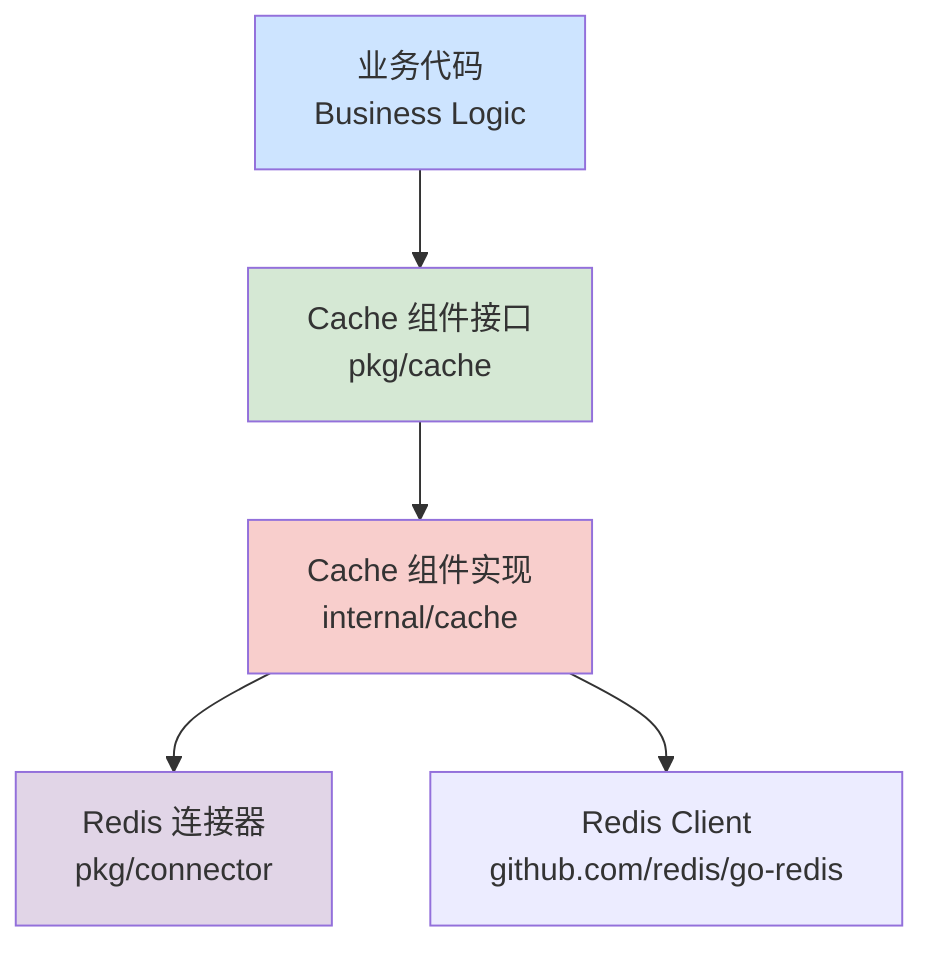

# 缓存组件 (Cache Component) 设计文档

## 1. 目标与定位

本设计旨在构建一个**轻量级、高性能**的缓存组件，核心基于 Redis 实现。

**核心设计理念：**

1. **原生体验 (Native Experience):** 保持 Redis 的原汁原味，提供简洁直观的操作接口。
2. **自动序列化 (Auto Serialization):** 自动处理对象的序列化和反序列化，业务层直接操作结构体。
3. **类型安全 (Type Safety):** 利用泛型减少类型断言，提供编译时类型检查。
4. **统一命名空间 (Unified Namespace):** 提供透明的 Key 前缀管理，确保不同应用的隔离性。

## 2. 架构设计

### 2.1. 模块位置与依赖



### 2.2. 核心接口定义 (`pkg/cache`)

接口保持极简，覆盖 Redis 的核心数据结构操作。

```go
package types

import (
   "context"
   "time"
)

// Cache 定义了缓存组件的核心能力
type Cache interface {
   // --- Key-Value ---
   Set(ctx context.Context, key string, value any, ttl time.Duration) error
   Get(ctx context.Context, key string, dest any) error
   Delete(ctx context.Context, key string) error
   Has(ctx context.Context, key string) (bool, error)
   Expire(ctx context.Context, key string, ttl time.Duration) error

   // --- Hash ---
   HSet(ctx context.Context, key string, field string, value any) error
   HGet(ctx context.Context, key string, field string, dest any) error
   HGetAll(ctx context.Context, key string, destMap any) error
   HDel(ctx context.Context, key string, fields ...string) error
   HIncrBy(ctx context.Context, key string, field string, increment int64) (int64, error)

   // --- Sorted Set ---
   ZAdd(ctx context.Context, key string, score float64, member any) error
   ZRem(ctx context.Context, key string, members ...any) error
   ZScore(ctx context.Context, key string, member any) (float64, error)
   ZRange(ctx context.Context, key string, start, stop int64, destSlice any) error
   ZRevRange(ctx context.Context, key string, start, stop int64, destSlice any) error
   ZRangeByScore(ctx context.Context, key string, min, max float64, destSlice any) error

   // --- List ---
   LPush(ctx context.Context, key string, values ...any) error
   RPush(ctx context.Context, key string, values ...any) error
   LPop(ctx context.Context, key string, dest any) error
   RPop(ctx context.Context, key string, dest any) error
   LRange(ctx context.Context, key string, start, stop int64, destSlice any) error
   LPushCapped(ctx context.Context, key string, limit int64, values ...any) error

   // --- Utility ---
   Close() error
}
```

## 3. 详细设计

### 3.1. 配置设计

配置设计简洁明了，支持 Key 前缀和序列化方式配置。

```go
// pkg/cache/types/config.go

type Config struct {
    // Prefix: 全局 Key 前缀 (e.g., "app:v1:")
    Prefix string `json:"prefix" yaml:"prefix"`
    
    // RedisConnectorName: 使用的 Redis 连接器名称 (e.g., "default")
    RedisConnectorName string `json:"redis_connector_name" yaml:"redis_connector_name"`
    
    // Serializer: "json" | "msgpack"
    Serializer string `json:"serializer" yaml:"serializer"`
}
```

### 3.2. 实现逻辑 (`internal/cache`)

在初始化阶段，根据配置创建 Redis 缓存实例。

```go
// internal/cache/redis/cache.go (伪代码)

func New(conn connector.RedisConnector, cfg *Config) (cache.Cache, error) {
    redisClient := conn.GetClient()
    
    // 创建序列化器
    serializer := createSerializer(cfg.Serializer)
    
    return &redisCache{
        client:     redisClient,
        serializer: serializer,
        prefix:     cfg.Prefix,
    }, nil
}
```

**核心实现特性：**

* **序列化:** 所有 Value 自动进行 Marshal/Unmarshal，支持 JSON 和 MessagePack
* **Key 前缀:** 所有 Key 自动加上配置的前缀，确保命名空间隔离
* **Capped List:** 使用 Pipeline 保证 LPUSH + LTRIM 的原子性

## 4. 使用示例

### 4.1. 基础缓存操作

```go
// 缓存用户信息
user := User{ID: 1001, Name: "Alice"}
err := cache.Set(ctx, "user:1001", user, 1*time.Hour)
if err != nil {
    return err
}

// 获取用户信息
var cachedUser User
err = cache.Get(ctx, "user:1001", &cachedUser)
```

### 4.2. 哈希操作

```go
// 存储用户属性
err := cache.HSet(ctx, "user:1001:profile", "name", "Alice")
err := cache.HSet(ctx, "user:1001:profile", "email", "alice@example.com")

// 获取所有属性
var profile map[string]string
err = cache.HGetAll(ctx, "user:1001:profile", &profile)
```

### 4.3. 排序集合操作

```go
// 更新排行榜
err := cache.ZAdd(ctx, "leaderboard", 95.5, "user:1001")
err := cache.ZAdd(ctx, "leaderboard", 87.3, "user:1002")

// 获取前 10 名
var topUsers []string
err = cache.ZRevRange(ctx, "leaderboard", 0, 9, &topUsers)
```

### 4.4. 列表操作

```go
// 定长列表 - 只保留最近 100 条日志
type LogEntry struct {
    Level string
    Msg   string
}

entry := LogEntry{Level: "INFO", Msg: "System started"}
err := cache.LPushCapped(ctx, "logs", 100, entry)

// 获取最近 20 条日志
var logs []LogEntry
err = cache.LRange(ctx, "logs", 0, 19, &logs)
```

## 5. 总结

本缓存组件设计充分利用了 Redis 的优势：

* **简洁性:** 接口设计简洁直观，易于使用
* **类型安全:** 自动序列化和泛型支持，减少运行时错误
* **灵活性:** 支持 Redis 的核心数据结构操作
* **高性能:** 基于原生 Redis 客户端，性能优异
