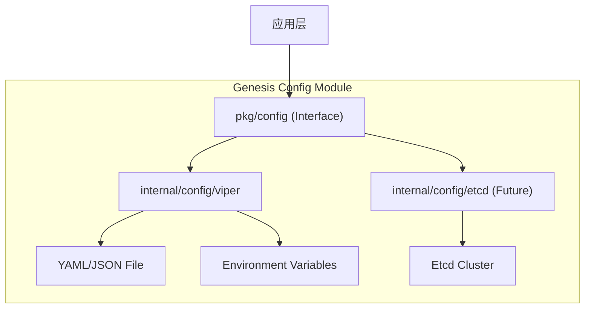

# Genesis 配置中心设计文档

## 1. 目标与愿景

配置中心 (Config Center) 旨在为 Genesis 框架提供统一、灵活且支持动态更新的配置管理能力。

**核心目标：**

1. **统一管理:** 集中管理所有组件（DB, Redis, Log, MQ 等）的配置。
2. **多源支持:** 支持从多种来源加载配置，包括本地文件 (YAML/JSON)、环境变量 (Env)、以及未来的远程配置中心 (Etcd/Consul)。
3. **热更新 (Hot Reload):** 支持配置的动态监听与实时更新，无需重启服务。
4. **类型安全:** 提供强类型的配置解析与绑定能力。
5. **接口抽象:** 遵循 Genesis 的接口驱动原则，屏蔽底层实现（Viper/Etcd），便于未来切换。

## 2. 核心设计

### 2.1. 架构分层

遵循 Genesis 的分层架构：

* **`pkg/config` (API 层):** 定义配置管理的通用接口和标准配置结构。
* **`internal/config` (实现层):** 提供基于 Viper 的默认实现，以及未来基于 Etcd 的实现。
* **`pkg/container` (集成层):** 负责在应用启动时初始化配置模块，并将配置注入到各个组件中。



### 2.2. 接口定义 (`pkg/config`)

```go
package config

import (
    "context"
    "time"
    
    "github.com/ceyewan/genesis/pkg/container"
)

// Manager 定义配置管理器的核心行为
// 它同时实现了 container.Lifecycle 接口，以便被容器管理（用于启动 Watcher 等后台任务）
type Manager interface {
    container.Lifecycle // Start, Stop, Phase

    // Load 加载配置（通常在 Start 之前调用，用于 Bootstrap）
    Load(ctx context.Context) error
    
    // Get 获取原始配置值
    Get(key string) any
    
    // Unmarshal 将配置解析到结构体
    Unmarshal(v any) error
    
    // UnmarshalKey 将指定 Key 的配置解析到结构体
    UnmarshalKey(key string, v any) error
    
    // Watch 监听配置变化
    // 返回一个只读 channel，当配置发生变化时发送事件
    // 可以通过 context 取消监听
    Watch(ctx context.Context, key string) (<-chan Event, error)
    
    // Validate 验证当前配置的有效性
    Validate() error
}

// Event 配置变更事件
type Event struct {
    Key       string
    Value     any
    OldValue  any       // 旧值 (如果支持)
    Source    string    // "file", "env", "remote"
    Timestamp time.Time
}

// Option 配置选项模式
type Option func(*Options)

type Options struct {
    Name       string
    Paths      []string
    FileType   string
    EnvPrefix  string
    RemoteOpts *RemoteOptions
}

type RemoteOptions struct {
    Provider string
    Endpoint string
}
```

### 2.3. 配置加载优先级

配置加载遵循以下优先级（由高到低）：

1. **启动参数 (Flags):** (暂未实现，预留)
2. **环境变量 (Env):** `GENESIS_MYSQL_HOST` 覆盖配置文件。
3. **环境特定配置文件:** `config.dev.yaml` (如果存在)。
4. **基础配置文件:** `config.yaml`。
5. **默认值 (Defaults):** 代码中硬编码的默认值。

### 2.4. 环境变量规则

* **前缀:** 默认为 `GENESIS` (可通过 Option 修改)。
* **分隔符:** 使用下划线 `_` 替代层级点 `.`。
* **格式:** `{PREFIX}_{SECTION}_{KEY}` (全大写)。

**示例:**

* YAML: `mysql.host`
* Env: `GENESIS_MYSQL_HOST`

### 2.5. 多环境支持

推荐的目录结构：

```text
config/
├── config.yaml          # 基础配置 (Base)
├── config.dev.yaml      # 开发环境覆盖 (Override)
├── config.prod.yaml     # 生产环境覆盖
└── config.local.yaml    # 本地开发覆盖 (git ignored)
```

加载逻辑：先加载 `config.yaml`，然后根据 `GENESIS_ENV` 环境变量加载对应的 `config.{env}.yaml` 进行合并覆盖。

## 3. 实现细节 (Viper)

当前阶段使用 `spf13/viper` 作为核心实现。

### 3.1. 初始化流程

1. **New:** 创建 Manager 实例，配置 Options。
2. **Load:**
    * 设置默认值。
    * 读取 `config.yaml`。
    * 读取 `config.{env}.yaml` (如果指定)。
    * 读取环境变量 (AutomaticEnv)。
    * 合并所有配置源。
3. **Start:** 启动 `WatchConfig` 协程，监听文件变更。

### 3.2. 热更新实现

利用 Viper 的 `WatchConfig` 能力。

```go
// internal/config/viper/manager.go

func (m *viperManager) Watch(ctx context.Context, key string) (<-chan Event, error) {
    ch := make(chan Event, 1)
    
    m.v.OnConfigChange(func(e fsnotify.Event) {
        // 1. 重新读取配置
        // 2. 检查指定 key 是否真的变化
        // 3. 发送事件到 ch
    })
    m.v.WatchConfig()
    
    // 处理 context 取消
    go func() {
        <-ctx.Done()
        close(ch)
        // 清理逻辑
    }()
    
    return ch, nil
}
```

## 4. 演进路线

### Phase 1: 本地文件 + 环境变量 (Current)

* [x] 定义 `pkg/config` 接口。
* [x] 实现基于 Viper 的文件加载与环境变量覆盖。
* [x] 实现 `Watch` 机制 (Channel based)。
* [x] 集成到 `pkg/container`。

### Phase 2: 远程配置中心 (Future)

* [ ] 集成 Viper Remote Provider (Etcd)。
* [ ] 实现配置版本管理。
* [ ] 实现配置回滚。
