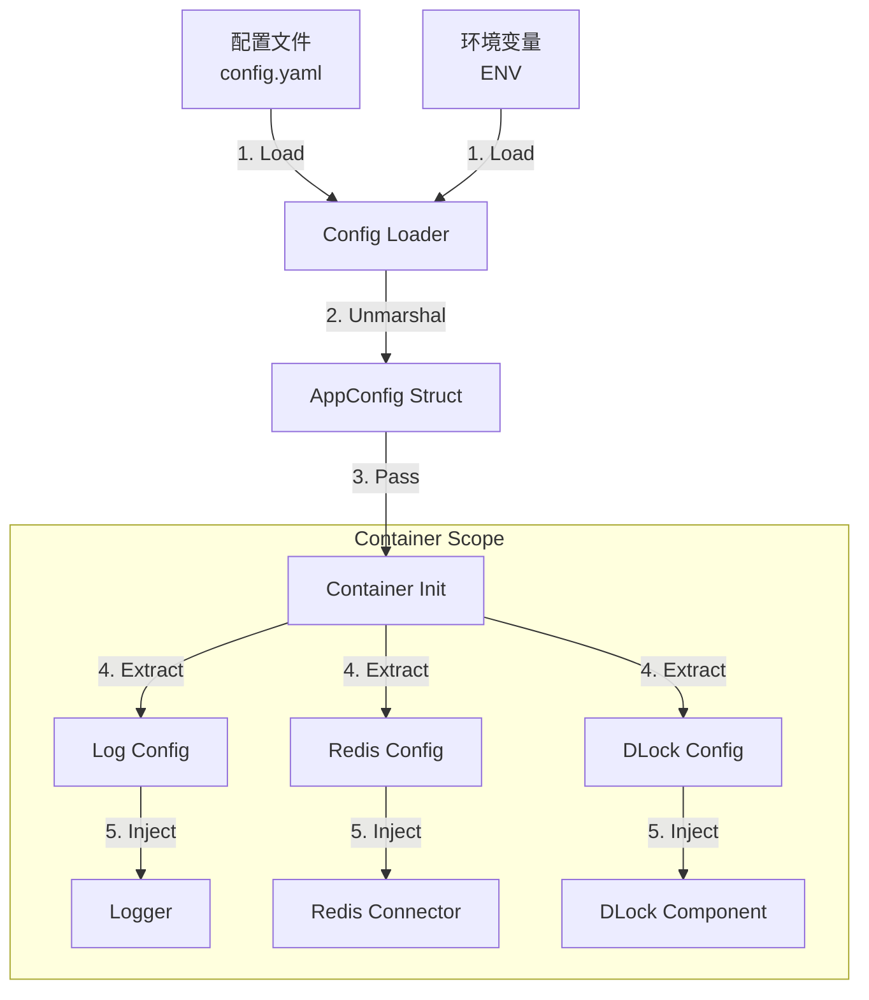

# Genesis 配置设计文档 (Config Design)

## 1. 目标与原则

配置组件旨在为 Genesis 框架提供统一、类型安全且易于扩展的配置管理能力。

**核心原则：**

1. **集中管理 (Centralized):** 所有组件的配置由统一的 `AppConfig` 结构体定义，避免散落在各处。
2. **类型安全 (Type-Safe):** 业务代码和组件通过强类型的结构体访问配置，而非 `map[string]interface{}`。
3. **自顶向下 (Top-Down):** 配置由 `main` 函数加载，传递给 `Container`，再由 `Container` 分发给各组件。组件本身不感知配置文件的存在。
4. **多源支持 (Multi-Source):** 支持从 YAML、JSON、环境变量 (Env)、命令行参数 (Flags) 加载配置。

## 2. 架构设计

### 2.1 配置流向



### 2.2 核心结构体 (`AppConfig`)

`AppConfig` 是整个应用的配置根节点，它聚合了所有基础设施和组件的配置。

```go
// pkg/config/types/config.go

type AppConfig struct {
    // 应用基础信息
    App AppInfo `yaml:"app" json:"app"`

    // 基础设施配置 (Connectors)
    Connectors ConnectorsConfig `yaml:"connectors" json:"connectors"`

    // 业务组件配置 (Components)
    Components ComponentsConfig `yaml:"components" json:"components"`
    
    // 可观测性配置
    Log     clog.Config        `yaml:"log" json:"log"`
    Metrics observability.Config `yaml:"metrics" json:"metrics"`
}

type AppInfo struct {
    Name      string `yaml:"name" json:"name"`
    Version   string `yaml:"version" json:"version"`
    Namespace string `yaml:"namespace" json:"namespace"` // 用于日志和 Metrics 的根命名空间
    Env       string `yaml:"env" json:"env"`             // dev, test, prod
}

type ConnectorsConfig struct {
    Redis map[string]connector.RedisConfig `yaml:"redis" json:"redis"`
    MySQL map[string]connector.MySQLConfig `yaml:"mysql" json:"mysql"`
    Etcd  map[string]connector.EtcdConfig  `yaml:"etcd" json:"etcd"`
    NATS  map[string]connector.NATSConfig  `yaml:"nats" json:"nats"`
}

type ComponentsConfig struct {
    DLock     dlock.Config     `yaml:"dlock" json:"dlock"`
    DB        db.Config        `yaml:"db" json:"db"`
    Cache     cache.Config     `yaml:"cache" json:"cache"`
    MQ        mq.Config        `yaml:"mq" json:"mq"`
    IDGen     idgen.Config     `yaml:"idgen" json:"idgen"`
    RateLimit ratelimit.Config `yaml:"ratelimit" json:"ratelimit"`
}
```

## 3. 接口定义

配置组件主要提供加载和验证功能。

```go
// pkg/config/interface.go

type Loader interface {
    // Load 加载配置到目标结构体
    // path: 配置文件路径
    // target: 目标结构体指针 (通常是 &AppConfig)
    Load(path string, target interface{}) error
}

// 默认实现支持 YAML/JSON 和 ENV 覆盖
// ENV 规则: GENESIS_APP_NAME 覆盖 app.name
```

## 4. 使用示例

### 4.1 配置文件 (`config.yaml`)

```yaml
app:
  name: "order-service"
  namespace: "order-service"
  env: "prod"

log:
  level: "info"
  format: "json"

connectors:
  redis:
    default:
      addr: "localhost:6379"
      db: 0
  mysql:
    primary:
      dsn: "user:pass@tcp(127.0.0.1:3306)/orders"

components:
  dlock:
    backend: "redis"
    redis_connector: "default" # 引用 connectors.redis.default
    prefix: "dlock:"
    default_ttl: "30s"
```

### 4.2 代码集成

```go
func main() {
    // 1. 定义配置变量
    var cfg config.AppConfig

    // 2. 加载配置
    if err := config.Load("config.yaml", &cfg); err != nil {
        panic(err)
    }

    // 3. 初始化 Container
    // Container 内部会解析 cfg.Connectors 和 cfg.Components
    c := container.New(cfg)

    // 4. 启动
    c.Start(context.Background())
}
```

## 5. 最佳实践

1. **环境隔离:** 建议使用 `config.yaml` (默认), `config.dev.yaml`, `config.prod.yaml` 分离不同环境配置。
2. **敏感信息:** 密码、密钥等敏感信息**禁止**明文写在配置文件中，必须通过环境变量注入（如 `GENESIS_CONNECTORS_MYSQL_PRIMARY_DSN`）。
3. **默认值:** 各组件的 `Config` 结构体应实现 `SetDefaults()` 方法，确保在配置缺失时有合理的默认行为。
4. **验证:** 各组件的 `Config` 结构体应实现 `Validate()` 方法，在启动阶段尽早发现配置错误。
