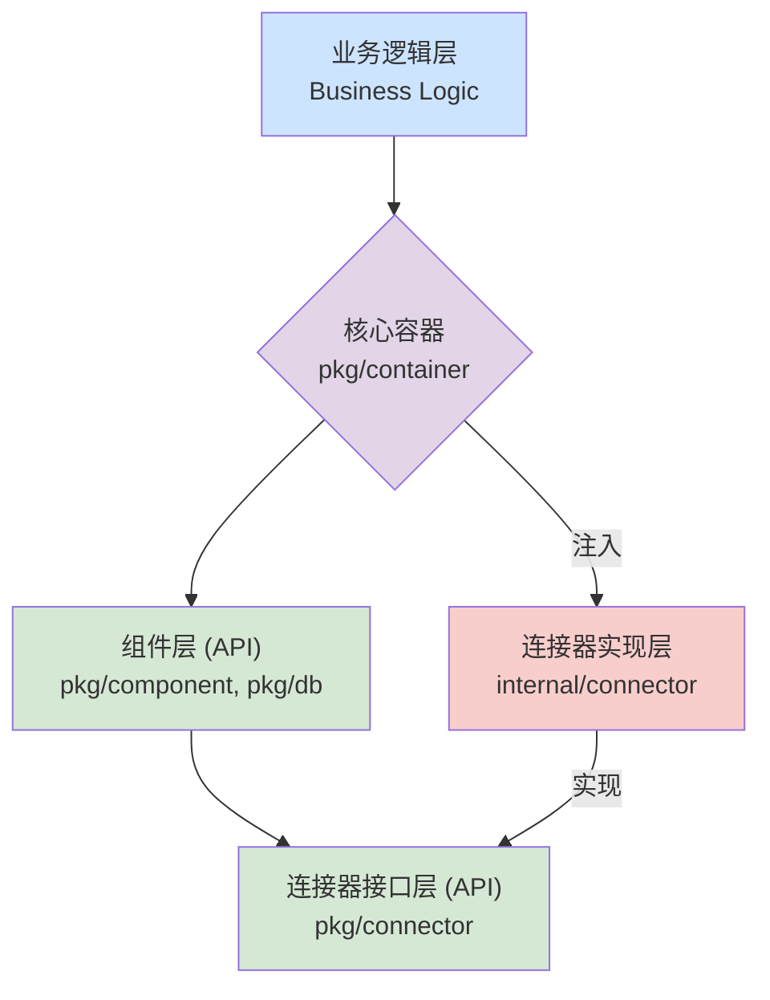

# 微服务框架：连接器与组件设计文档

## 1. 目标与核心原则

本设计旨在为微服务框架提供一个统一、健壮且可扩展的外部服务连接管理方案。它通过**分层解耦**、**集中管理**和**面向接口**的设计，构建一个易于使用、维护和扩展的基础设施层。

**核心设计原则：**

1. **分层与抽象 (Layering & Abstraction):**
    * **连接器 (Connector):** 专职**管理原始连接**。负责与外部基础设施（如 MySQL, Redis）建立、复用、监控和关闭连接。
    * **组件 (Component):** 专职**封装业务功能**。构建于连接器之上，提供面向业务场景的高级、抽象的 API（如事务、分布式锁）。
2. **接口隔离与依赖倒置 (Interface Segregation & Dependency Inversion):**
    * 所有公开 API 和接口定义于 `pkg/` 目录，作为框架的稳定契约。
    * 所有具体实现封装于 `internal/` 目录，对用户代码不可见。
    * 高层模块（组件）依赖于底层模块（连接器）的**抽象接口**，而非具体实现。

3. **生命周期管理 (Lifecycle Management):**
    * 所有需要初始化和清理资源的模块（连接器、组件）都应实现统一的 `Lifecycle` 接口。
    * 由核心**容器 (Container)** 负责按预定顺序（`Phase`）进行启动和关闭，确保依赖关系正确，并实现优雅停机 (Graceful Shutdown)。

4. **集中化管理 (Centralized Management):**
    * 通过 `internal/connector/manager` 模式，对同一类型和配置的连接进行**缓存和复用**，实现高效的资源利用和并发安全。

5. **可观测性 (Observability):**
    * 框架设计应内建对日志、指标 (Metrics) 和追踪 (Tracing) 的支持，便于监控系统状态和排查问题。

## 2. 核心概念定义

1. **连接器 (Connector):**
    * **职责:** 管理与外部基础设施的**原始连接**。
    * **位置:** 接口位于 `pkg/connector/`，实现位于 `internal/connector/`。
    * **核心:** 负责连接的建立、关闭、连接池、健康检查。向内部暴露**类型安全**的原始客户端实例。
    * **目标:** 屏蔽底层驱动差异，提供稳定、可监控的连接源。

2. **组件 (Component):**
    * **职责:** 提供面向业务场景的**高级功能封装**。
    * **位置:** `pkg/component/`, `pkg/db/`, `pkg/mq/` 等。
    * **核心:** 基于一个或多个连接器，封装通用业务模式（如事务、分布式锁、消息发布订阅），提供简洁的业务 API。
    * **目标:** 提升开发效率，统一业务范式，增强代码可读性。

3. **容器 (Container):**
    * **职责:** 应用的**“心脏”，负责组装、管理所有依赖**。
    * **位置:** `pkg/container/`。
    * **核心:** 在应用启动时，通过依赖注入（DI）初始化所有连接器和组件，并编排它们的生命周期。
    * **目标:** 简化应用初始化，清晰化依赖关系，实现资源的有序启动和优雅关闭。

## 3. 整体架构

### 3.1. 架构分层视图



### 3.2. 项目结构

```text
genesis/
├── internal/
│   ├── connector/          # 连接器实现层 (实现 pkg/connector 接口)
│   │   ├── manager.go      # 通用连接管理器 (复用、生命周期)
│   │   ├── mysql/
│   │   └── redis/
└── pkg/
    ├── component/          # 通用功能组件
    │   └── locking/
    ├── connector/          # 连接器抽象层 (定义接口)
    │   ├── interface.go
    │   ├── config.go       # 连接器配置定义
    │   └── errors.go       # 统一错误定义
    ├── container/          # 核心 DI 容器与生命周期编排
    │   ├── container.go
    │   └── lifecycle.go
    ├── db/                 # DB 领域组件
    └── clog/               # 日志组件 (基础核心组件)
```

## 4. 连接器层 (Connector) 深度设计

### 4.1. 统一接口 (`pkg/connector`)

通过定义一组标准接口，确保所有连接器行为一致。

````go
// pkg/connector/interface.go
package connector

import "context"

// Connector 是所有连接器的基础接口
type Connector interface {
    // Connect 负责建立连接，应幂等且并发安全
    Connect(ctx context.Context) error
    // Close 负责关闭连接，释放资源
    Close() error
    // HealthCheck 检查连接的健康状态
    HealthCheck(ctx context.Context) error
    // IsHealthy 返回一个缓存的、快速的健康状态标志
    IsHealthy() bool
    // Name 返回此连接实例的唯一名称（如：mysql.primary）
    Name() string
}

// TypedConnector 是一个泛型接口，用于提供类型安全的客户端访问
type TypedConnector[T any] interface {
    Connector
    GetClient() T
}

// Configurable 定义了配置验证的能力
type Configurable interface {
    Validate() error
}

// Reloadable 定义了热重载配置的能力 (可选实现)
type Reloadable interface {
    Reload(ctx context.Context, newConfig Configurable) error
}

// MySQLConnector 是 MySQL 连接器的具体接口定义
type MySQLConnector interface {
    TypedConnector[*gorm.DB]
    Configurable
}

// RedisConnector 是 Redis 连接器的具体接口定义
type RedisConnector interface {
    TypedConnector[*redis.Client]
    Configurable
}
````

### 4.2. 统一错误处理 (`pkg/connector`)

定义标准的错误类型，便于上层进行统一的错误处理和判断。

````go
// pkg/connector/errors.go
package connector

type ErrorType int

const (
    ErrConnection ErrorType = iota // 连接建立失败
    ErrTimeout                     // 操作超时
    ErrConfig                      // 配置错误
    ErrHealthCheck                 // 健康检查失败
    ErrClosed                      // 连接已关闭
)

type Error struct {
    Type      ErrorType // 错误类型
    Connector string    // 出错的连接器名称
    Cause     error     // 原始错误
    Retryable bool      // 是否可重试
}

func (e *Error) Error() string {
    return fmt.Sprintf("connector[%s] error: type=%d, retryable=%v, cause=%v", e.Connector, e.Type, e.Retryable, e.Cause)
}
````

### 4.3. 连接管理器 (`internal/connector/manager`)

管理器是连接器实现的核心，它不直接暴露给用户，但负责所有连接的生命周期和复用。

**核心职责：**

1. **实例缓存:** 根据配置的哈希值缓存连接器实例，确保相同配置只创建一个连接。
2. **引用计数:** 通过引用计数安全地管理连接的创建 (`Get`) 和销毁 (`Release`)。当引用计数归零时，才真正关闭连接。
3. **并发安全:** 所有对外的 `Get` 和 `Release` 方法都是线程安全的。
4. **工厂模式:** 通过泛型工厂函数创建不同类型的连接器实例。

```go
// internal/connector/manager.go (示意代码)
package manager

// Manager 负责管理某一类连接器的所有实例
type Manager[T connector.Connector] struct {
    mu         sync.RWMutex
    instances  map[string]*managedInstance[T] // key 为配置的 hash
    factory    func(config any) (T, error)    // 创建具体连接器的工厂函数
}

type managedInstance[T connector.Connector] struct {
    instance T
    refCount int32
}

func (m *Manager[T]) Get(config any) (T, error) {
    // 1. 计算 config 的 hash
    // 2. 加锁检查 instance 是否已存在
    // 3. 如果存在，增加引用计数并返回
    // 4. 如果不存在，调用 factory 创建新实例，存入 map，设置引用计数为 1，然后返回
}

func (m *Manager[T]) Release(config any) error {
    // 1. 计算 config 的 hash
    // 2. 加锁减少引用计数
    // 3. 如果引用计数归零，调用 instance.Close() 并从 map 中移除
}
```

## 5. 核心容器 (Core Container) 深度设计

容器是整个应用的粘合剂和启动器。

### 5.1. 生命周期接口 (`pkg/container`)

定义一个所有可管理对象（连接器、需要启动/关闭的组件）都必须实现的接口。

````go
// pkg/container/lifecycle.go
package container

import "context"

// Lifecycle 定义了可由容器管理生命周期的对象的行为
type Lifecycle interface {
    // Start 启动服务，Phase 越小越先启动
    Start(ctx context.Context) error
    // Stop 关闭服务，按启动的逆序调用
    Stop(ctx context.Context) error
    // Phase 返回启动阶段，用于排序。例如：
    // 0: 基础日志
    // 10: 连接器 (Connectors)
    // 20: 业务组件 (Components)
    Phase() int
}
````

### 5.2. 容器实现 (`pkg/container`)

容器负责依据 `Phase` 顺序，有序地启动和关闭所有 `Lifecycle` 对象。

```go
// pkg/container/container.go (示意代码)
package container

// Container 聚合了所有组件，是应用的统一访问入口
type Container struct {
    Log       clog.Logger
    DB        db.DB
    Cache     cache.Cache
    // ... 其他组件

    lifecycles []Lifecycle // 存储所有需要管理生命周きの对象
}

func New(cfg *Config) (*Container, error) {
    // 1. 初始化所有 Connectors 和 Components，并将它们注册到 lifecycles 数组中
    //    - e.g., redisConn, err := redisManager.Get(cfg.Redis)
    //    - e.g., cacheComponent := cache.New(redisConn)
    //    - c.lifecycles = append(c.lifecycles, redisConn, cacheComponent)

    // 2. 启动所有生命周期对象
    if err := c.startAll(); err != nil {
        // 如果启动失败，尝试优雅回滚
        c.stopAll()
        return nil, err
    }
    
    return &Container{...}, nil
}

func (c *Container) startAll() error {
    // 根据 Phase 对 lifecycles 进行排序
    sort.Slice(c.lifecycles, func(i, j int) bool {
        return c.lifecycles[i].Phase() < c.lifecycles[j].Phase()
    })

    // 顺序启动
    for _, lc := range c.lifecycles {
        if err := lc.Start(context.Background()); err != nil {
            // 如果一个组件启动失败，立即返回错误
            return fmt.Errorf("failed to start component (phase %d): %w", lc.Phase(), err)
        }
    }
    return nil
}

func (c *Container) Close() {
    c.stopAll()
}

func (c *Container) stopAll() {
    // 逆序关闭
    for i := len(c.lifecycles) - 1; i >= 0; i-- {
        // 忽略关闭过程中的错误，以确保所有组件都尝试关闭
        _ = c.lifecycles[i].Stop(context.Background())
    }
}
```

## 6. 使用示例

最终，业务代码的开发体验将变得极为简洁和统一。

```go
// cmd/server/main.go
package main

func main() {
    // 1. 加载配置
    cfg, err := loadConfig()
    if err != nil {
        log.Fatalf("failed to load config: %v", err)
    }

    // 2. 创建并启动应用容器
    app, err := container.New(cfg)
    if err != nil {
        log.Fatalf("failed to start application: %v", err)
    }
    // 注册优雅关闭
    defer app.Close()

    // 3. 使用组件
    ctx := context.Background()
    app.Log.InfoContext(ctx, "service started successfully")

    // 使用 DB 组件进行事务操作
    err = app.DB.Transaction(ctx, func(tx db.Tx) error {
        // 在这里执行数据库操作
        // ...
        return nil
    })
    if err != nil {
        app.Log.ErrorContext(ctx, "transaction failed", "error", err)
    }

    // 使用 Cache 组件
    app.Cache.Set(ctx, "user:1", []byte("data"), time.Minute)

    // 阻塞主协程，等待中断信号
    // ...
}
```

## 7. 总结

这份设计方案通过明确的**分层**、**接口**和**生命周期管理**，构建了一个健壮、可扩展且易于维护的框架基础。其核心优势在于：

* **高内聚低耦合：** 连接器和组件职责单一，通过接口解耦。
* **资源安全：** 通过 Manager 和 Container 确保连接被高效复用和安全释放。
* **启动/关闭健壮性：** 有序的生命周期管理保证了应用的稳定启动和优雅停机。
* **开发体验统一：** 开发者通过统一的容器入口与框架交互，无需关心底层细节。
