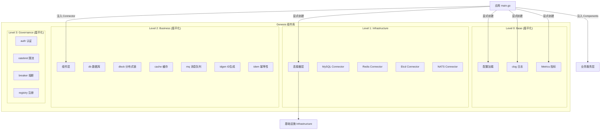

# Genesis 架构设计文档

## 1. 愿景 (Vision)

Genesis 旨在打造一个**轻量级、标准化、高可扩展**的 Go 微服务**组件库**。它不是一个包罗万象的庞大框架，而是一套精心设计的**组件集合**和**架构规范**。

> **重要**：项目已完成四层扁平化架构重构，所有组件均已符合 v0.1.0 发布标准。

我们的目标是让开发者能够像搭积木一样构建微服务，既能享受标准化的便利，又不失对底层技术的掌控力。

**Genesis 是组件库，不是框架**——我们提供积木，用户自己搭建。

## 2. 核心设计哲学 (Design Philosophy)

Genesis 的设计遵循 Go 语言的核心哲学：

1. **显式优于隐式 (Explicit over Implicit):**
    - 依赖关系在代码中显式声明，而非隐藏在容器或框架内部。
    - 使用构造函数注入，函数签名即是依赖文档。

2. **简单优于聪明 (Simple over Clever):**
    - 不使用运行时 DI 容器，避免"魔法"代码。
    - 利用 Go 的 `defer` 机制自然管理资源生命周期。

3. **组合优于继承 (Composition over Inheritance):**
    - 组件通过接口组合，而非继承层次。
    - 业务代码依赖最小接口，易于测试和 Mock。

4. **分层架构 (Layered Architecture):**
    - **Connector (连接器):** 负责基础设施的原始连接管理（如 MySQL, Redis 连接池），屏蔽驱动差异。
    - **Component (组件):** 基于连接器封装业务通用能力（如分布式锁、缓存），提供面向业务的 API。

5. **接口驱动 (Interface Driven):**
    - 对外暴露接口，隐藏实现细节。
    - 便于测试（Mock）和未来替换底层实现。

## 3. 总体架构 (Architecture)

### 3.1. 四层模型

移除 DI 容器后，Genesis 简化为清晰的四层结构：

| 层次                        | 核心组件                                       | 职责                         | 组织方式 |
| :-------------------------- | :--------------------------------------------- | :--------------------------- | :------- |
| **Level 3: Governance**     | `auth`, `ratelimit`, `breaker`, `registry`     | 流量治理，身份认证，切面能力 | 扁平化   |
| **Level 2: Business**       | `cache`, `idgen`, `dlock`, `idem`, `mq` | 业务能力封装                 | 扁平化   |
| **Level 1: Infrastructure** | `connector`, `db`                              | 连接管理，底层 I/O           | 扁平化   |
| **Level 0: Base**           | `clog`, `config`, `metrics`, `xerrors`         | 框架基石                     | 扁平化   |

### 3.2. 架构图



**关键点**：没有中央容器，所有依赖在 `main.go` 中显式创建和注入。所有 L0-L3 组件均采用扁平化设计。

## 4. 核心模块概览

### 4.1. Level 0: 基础能力 (Base)

Genesis 所有组件统一使用 L0 基础组件，确保一致的可观测性和错误处理。L0 组件采用**扁平化设计**，所有公开 API 直接在组件根目录：

- **clog (Context Logger):** 基于 `slog` 的结构化日志库，支持 Context 字段自动提取、命名空间派生。所有组件通过 `WithLogger` 注入。

- **config:** 统一的配置加载，从本地文件 / 环境变量加载强类型配置。

- **metrics:** 基于 OpenTelemetry 的指标收集能力。所有组件通过 `WithMeter` 注入，自动埋点。

- **xerrors:** 统一的错误码和错误包装器。所有组件使用 `xerrors` 定义 Sentinel Errors 和包装错误。

### 4.2. Level 1: 连接器 (Connectors)

位于根目录 `connector/`，提供统一的连接管理接口：

- **MySQL:** 基于 GORM 的连接管理，**拥有**连接池资源。
- **Redis:** 基于 go-redis 的连接管理，**拥有**连接池资源。
- **Etcd:** 基于 clientv3 的连接管理。
- **NATS:** 基于 nats.go 的连接管理。

**资源所有权**：Connector 创建并拥有连接，必须调用 `Close()` 释放资源。

### 4.3. Level 2: 业务组件 (Components)

位于根目录下的独立包，**借用** Connector 的连接：

- **db:** 集成 `gorm` 和 `sharding` 插件，支持分库分表。
- **dlock:** 统一接口的分布式锁，支持 Redis 和 Etcd 后端。
- **cache:** 缓存封装，支持 Redis / Memory 驱动。
- **mq:** 统一接口的消息队列，支持 NATS (Core/JetStream) / Redis Stream。
- **idgen:** 分布式 ID 生成器，支持 UUID/Snowflake/Sequencer。
- **idem:** 幂等性控制，支持手动调用、Gin、gRPC。

**资源所有权**：组件只借用 Connector 的 client，其 `Close()` 方法通常是 no-op。

### 4.4. Level 3: 治理组件 (Governance)

- **auth:** 身份认证与 JWT 处理。
- **ratelimit:** 分布式限流。
- **breaker:** 熔断器。
- **registry:** 服务注册与发现。

## 5. Go Native 依赖注入

### 5.1. 核心原则

Genesis 采用 Go 原生的显式依赖注入，而非 DI 容器：

```text
┌─────────────────────────────────────────────────────────────────┐
│                    Go Native 依赖注入                            │
├─────────────────────────────────────────────────────────────────┤
│  1. 构造函数注入：依赖通过 New() 参数传入                         │
│  2. 显式调用：main.go 中手写初始化代码，依赖关系一目了然           │
│  3. defer 释放：利用 Go 的 defer 机制，自然实现 LIFO 关闭顺序     │
│  4. 接口隔离：业务层只依赖需要的接口，而非具体实现                 │
└─────────────────────────────────────────────────────────────────┘
```

### 5.2. 标准初始化模式

```go
// main.go - 显式、清晰、可读
func main() {
    ctx, cancel := signal.NotifyContext(context.Background(), syscall.SIGINT, syscall.SIGTERM)
    defer cancel()

    // 1. 加载配置
    cfg, _ := config.Load("config.yaml")

    // 2. 初始化 Logger
    logger, _ := clog.New(&cfg.Log)

    // 3. 初始化 Telemetry (通过 metrics 等组件体现)
    // ...

    // 4. 创建 Connectors（defer 自动逆序关闭）
    redisConn, _ := connector.NewRedis(&cfg.Redis, connector.WithLogger(logger))
    defer redisConn.Close()

    mysqlConn, _ := connector.NewMySQL(&cfg.MySQL, connector.WithLogger(logger))
    defer mysqlConn.Close()

    // 5. 创建组件（注入 Connector + Logger）
    database, _ := db.New(&cfg.DB, db.WithMySQLConnector(mysqlConn), db.WithLogger(logger))
    locker, _ := dlock.New(&cfg.DLock, dlock.WithRedisConnector(redisConn), dlock.WithLogger(logger))
    cacheClient, _ := cache.New(&cfg.Cache, cache.WithRedisConnector(redisConn), cache.WithLogger(logger))

    // 6. 创建业务服务（注入组件接口）
    userSvc := service.NewUserService(database, locker)

    // 7. 启动服务器
    server := api.NewServer(userSvc)
    server.Run(ctx)
}
```

### 5.3. 资源生命周期管理

利用 Go 的 `defer` 自然实现资源管理，无需 Lifecycle 接口注册到中央容器：

```go
func main() {
    // 创建顺序：Config -> Logger -> Connector -> Component -> Service
    // 关闭顺序：Service -> Component -> Connector -> Logger (defer 自动逆序)

    redisConn := connector.MustNewRedis(&cfg.Redis)
    defer redisConn.Close() // 第 2 个关闭

    mysqlConn := connector.MustNewMySQL(&cfg.MySQL)
    defer mysqlConn.Close() // 第 1 个关闭

    // 组件借用连接，不负责连接池释放
    dlock := dlock.MustNewRedis(redisConn, &cfg.DLock)

    server := api.NewServer(dlock)
    defer server.Shutdown(ctx) // 第 1 个关闭

    server.Run(ctx)
}
```

## 6. 资源所有权模型

### 6.1. 核心原则

**谁创建，谁负责关闭。**

```text
┌─────────────────────────────────────────────────────────────────┐
│                     资源所有权模型                               │
├─────────────────────────────────────────────────────────────────┤
│                                                                 │
│   Connector (Owner)                                             │
│   ├── 创建 *redis.Client / *gorm.DB                            │
│   ├── 管理连接池                                                │
│   └── Close() 释放资源  ←── 必须调用                            │
│                                                                 │
│   Component (Borrower)                                          │
│   ├── Cache    ─┐                                               │
│   ├── DLock    ─┼── 借用 Connector.GetClient()                  │
│   ├── DB       ─┤                                               │
│   └── MQ       ─┘                                               │
│        │                                                        │
│        └── Close() 通常是 no-op（不拥有资源）                      │
│                                                                 │
└─────────────────────────────────────────────────────────────────┘
```

## 7. 目录结构规范

采用**完全扁平化**结构，所有组件直接放在根目录：

```text
genesis/
├── auth/                     # 认证组件 (L3) - 扁平化
├── breaker/                  # 熔断器 (L3) - 扁平化
├── clog/                     # 日志组件 (L0) - 扁平化
├── config/                   # 配置组件 (L0) - 扁平化
├── connector/                # 连接器 (L1) - 扁平化
├── db/                       # 数据库组件 (L1) - 扁平化
├── dlock/                    # 分布式锁 (L2) - 扁平化
├── cache/                    # 缓存 (L2) - 扁平化
├── idgen/                    # ID 生成 (L2) - 扁平化
├── idem/                     # 幂等性 (L2) - 扁平化
├── mq/                       # 消息队列 (L2) - 扁平化
├── metrics/                  # 指标组件 (L0) - 扁平化
├── ratelimit/                # 限流 (L3) - 扁平化
├── registry/                 # 服务注册 (L3) - 扁平化
├── testkit/                  # 测试工具包
├── trace/                    # 链路追踪工具
├── xerrors/                  # 错误处理 (L0) - 扁平化
├── docs/                     # 设计文档
├── examples/                 # 使用示例
├── go.mod
├── go.sum
├── Makefile
├── CLAUDE.md                 # AI 助手约束
└── README.md                 # 项目说明
```

**关键说明**：

- 所有组件采用**完全扁平化设计**，接口和实现在同一目录下，无 `pkg/` 或 `internal/` 分层
- 组件内部实现细节（如需要）可通过私有文件或子目录封装
- 每个组件都是独立的 Go 包，通过 `github.com/ceyewan/genesis/<component>` 引用

## 8. 组件开发规范 (Component Specification)

### 8.1. 构造函数规范

```go
// 标准签名
func New(conn Connector, cfg *Config, opts ...Option) (Interface, error)

// 规则：
// 1. 必选参数：核心依赖 (Connector) + 配置 (Config)
// 2. 可选参数：Logger/Meter/Tracer 通过 Option 注入
// 3. 禁止：New 中执行阻塞 I/O
```

### 8.2. Option 规范

```go
type options struct {
    logger clog.Logger
    meter  metrics.Meter
    tracer metrics.Tracer
}

type Option func(*options)

func WithLogger(l clog.Logger) Option {
    return func(o *options) {
        o.logger = l.With("component", "dlock")
    }
}
```

### 8.3. 错误处理规范

使用 `xerrors` 定义和包装错误：

```go
// dlock/errors.go
var (
    ErrLockNotHeld   = xerrors.New("dlock: lock not held")
)

// 使用时 Wrap 错误
return xerrors.Wrapf(ErrLockTimeout, "acquire lock %s", key)
```
