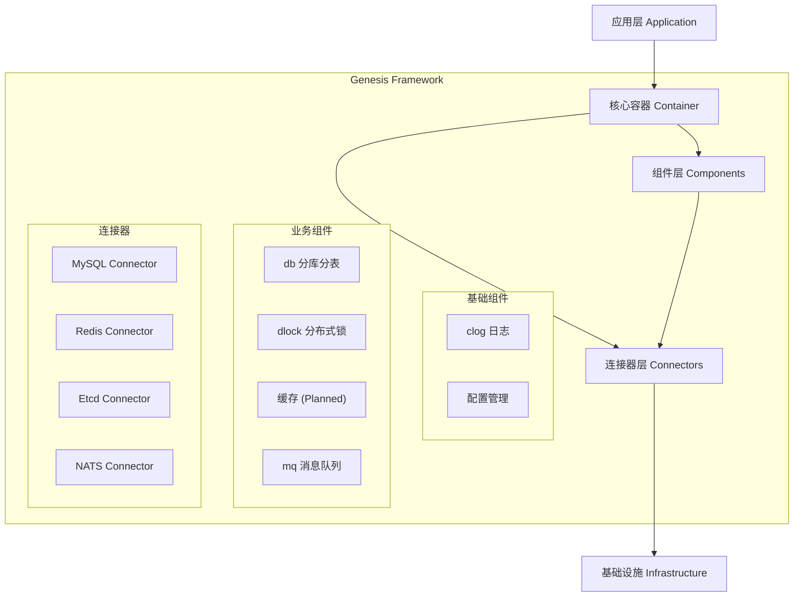

# Genesis 架构设计文档

## 1. 愿景 (Vision)

Genesis 旨在打造一个**轻量级、标准化、高可扩展**的 Go 微服务基座库。它不是一个包罗万象的庞大框架，而是一套精心设计的**组件集合**和**架构规范**。

我们的目标是让开发者能够像搭积木一样构建微服务，既能享受标准化的便利，又不失对底层技术的掌控力。

## 2. 核心设计哲学 (Design Philosophy)

Genesis 的设计遵循以下核心原则：

1. **分层架构 (Layered Architecture):**
    * **Connector (连接器):** 负责基础设施的原始连接管理（如 MySQL, Redis 连接池），屏蔽驱动差异。
    * **Component (组件):** 基于连接器封装业务通用能力（如分布式锁、分库分表 DB），提供面向业务的 API。
    * **Container (容器):** 负责依赖注入和生命周期管理，是应用的骨架。

2. **依赖注入 (Dependency Injection):**
    * 组件之间不直接实例化依赖，而是通过接口和构造函数注入。
    * 由核心容器统一管理对象的创建和组装，降低耦合度。

3. **生命周期管理 (Lifecycle Management):**
    * 统一的 `Start/Stop` 接口和 `Phase` 启动顺序。
    * 确保资源（连接、后台任务）能够有序启动和优雅关闭 (Graceful Shutdown)。

4. **接口驱动 (Interface Driven):**
    * 对外暴露接口 (`pkg/`), 隐藏实现细节 (`internal/`)。
    * 便于测试（Mock）和未来替换底层实现。

## 3. 总体架构 (Architecture)



## 4. 核心模块概览

### 4.1. 基础能力

* **clog (Context Logger):** 基于 `slog` 的结构化日志库，支持 Context 字段自动提取、多级命名空间。
* **container (Core Container):** 极简的 DI 容器，负责组件编排和生命周期管理。

### 4.2. 连接器 (Connectors)

位于 `pkg/connector`，提供统一的连接管理接口：

* **MySQL:** 基于 GORM 的连接管理。
* **Redis:** 基于 go-redis 的连接管理。
* **Etcd:** 基于 clientv3 的连接管理。
* **NATS:** 基于 nats.go 的连接管理。

### 4.3. 业务组件 (Components)

位于 `pkg/` 下的独立包，提供开箱即用的能力：

* **db:** 集成 `gorm` 和 `sharding` 插件，支持透明的分库分表和统一事务管理。
* **dlock:** 统一接口的分布式锁，支持 Redis 和 Etcd 后端，内置看门狗（自动续期）。
* **mq:** 统一接口的消息队列，支持 NATS Core (即时) 和 JetStream (持久化) 模式。

## 5. 演进路线 (Roadmap)

Genesis 将按照"在精不在多"的原则逐步演进：

### Phase 1: 核心基座 (Current)

* [x] **Log:** 结构化日志 (clog)
* [x] **Container:** 生命周期管理与 DI
* [x] **Connector:** 基础连接器 (MySQL, Redis, Etcd)
* [x] **DB:** 分库分表与事务封装
* [x] **DLock:** 分布式锁

### Phase 2: 中间件集成 (Next)

* [ ] **Cache:** 多级缓存接口与实现 (Local + Redis)
* [x] **MQ:** 消息队列封装 (基于 NATS/Kafka)
* [x] **ID Gen:** 分布式 ID 生成器 (Snowflake)
* [ ] **Metrics:** 统一监控指标 (Prometheus)

### Phase 3: 微服务治理 (Future)

* [ ] **Rate Limit:** 分布式限流
* [x] **Idempotency:** 幂等性控制组件
* [ ] **Registry:** 服务注册与发现
* [ ] **Config:** 动态配置中心
* [ ] **Circuit Breaker:** 熔断与降级

## 6. 目录结构规范

```text
genesis/
├── pkg/                # 公开 API 和接口定义
│   ├── clog/           # 日志组件
│   ├── connector/      # 连接器接口
│   ├── container/      # 容器接口
│   ├── db/             # 数据库组件
│   ├── dlock/          # 分布式锁组件
│   └── mq/             # 消息队列组件
├── internal/           # 内部实现细节 (不对外暴露)
│   ├── clog/
│   ├── connector/
│   ├── db/
│   ├── dlock/
│   └── mq/
├── deploy/             # 部署依赖 (Docker Compose 等)
├── docs/               # 设计文档
└── examples/           # 使用示例
```

## 7. 代码组织规范 (Code Organization)

为了解决 Go 语言中常见的循环依赖问题，同时保持 API 的整洁，Genesis 推荐以下组件代码组织结构：

```text
pkg/component/
├── component.go        # 统一入口：包含工厂方法 (New) 和类型别名导出
└── types/              # 类型定义：包含接口 (Interface) 和配置结构体 (Config)
    ├── config.go
    └── interface.go
internal/component/
├── component.go        # 核心逻辑实现
└── ...
```

* **`pkg/component/types`**: 定义接口和配置，不依赖其他包，作为最底层依赖。
* **`internal/component`**: 引用 `pkg/component/types` 实现具体逻辑。
* **`pkg/component`**: 引用 `internal/component` 暴露工厂方法，引用 `pkg/component/types` 导出类型别名，作为用户使用的统一入口。
