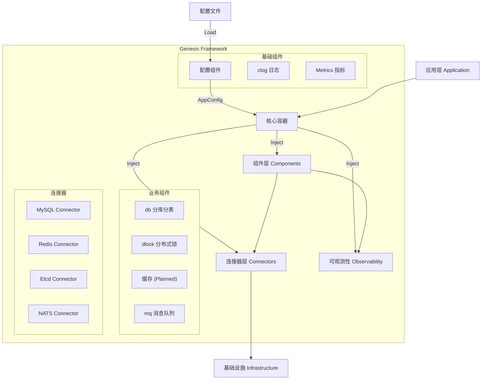

# Genesis 架构设计文档

## 1. 愿景 (Vision)

Genesis 旨在打造一个**轻量级、标准化、高可扩展**的 Go 微服务基座库。它不是一个包罗万象的庞大框架，而是一套精心设计的**组件集合**和**架构规范**。

我们的目标是让开发者能够像搭积木一样构建微服务，既能享受标准化的便利，又不失对底层技术的掌控力。

## 2. 核心设计哲学 (Design Philosophy)

Genesis 的设计遵循以下核心原则：

1. **分层架构 (Layered Architecture):**
    * **Connector (连接器):** 负责基础设施的原始连接管理（如 MySQL, Redis 连接池），屏蔽驱动差异。
    * **Component (组件):** 基于连接器封装业务通用能力（如分布式锁、分库分表 DB），提供面向业务的 API。
    * **Container (容器):** 负责依赖注入和生命周期管理，是应用的骨架。
2. **依赖注入 (Dependency Injection):**
    * 组件之间不直接实例化依赖，而是通过接口和构造函数注入。
    * 由核心容器统一管理对象的创建和组装，降低耦合度。
3. **生命周期管理 (Lifecycle Management):**
    * 统一的 `Start/Stop` 接口和 `Phase` 启动顺序。
    * 确保资源（连接、后台任务）能够有序启动和优雅关闭 (Graceful Shutdown)。
4. **接口驱动 (Interface Driven):**
    * 对外暴露接口 (`pkg/`), 隐藏实现细节 (`internal/`)。
    * 便于测试（Mock）和未来替换底层实现。

## 3. 总体架构 (Architecture)



## 4. 核心模块概览

### 4.1. 基础能力

* **clog (Context Logger):** 基于 `slog` 的结构化日志库，支持 Context 字段自动提取、多级命名空间。
* **config (Config Center):** 统一的配置中心接口，从本地文件 / 环境变量 / 远程配置源加载强类型 `AppConfig`，支持热更新。
* **telemetry (Metrics & Tracing):** 基于 OpenTelemetry 的指标与链路追踪能力，与 `clog` 集成，实现 Log–Metric–Trace 的关联。
* **container (Core Container):** 极简的 DI 容器，负责组件编排和生命周期管理，是应用的统一入口。

### 4.2. 连接器 (Connectors)

位于 `pkg/connector`，提供统一的连接管理接口：

* **MySQL:** 基于 GORM 的连接管理。
* **Redis:** 基于 go-redis 的连接管理。
* **Etcd:** 基于 clientv3 的连接管理。
* **NATS:** 基于 nats.go 的连接管理。

### 4.3. 业务组件 (Components)

位于 `pkg/` 下的独立包，提供开箱即用的能力：

* **db:** 集成 `gorm` 和 `sharding` 插件，支持透明的分库分表和统一事务管理。
* **dlock:** 统一接口的分布式锁，支持 Redis 和 Etcd 后端，内置看门狗（自动续期）。
* **mq:** 统一接口的消息队列，支持 NATS Core (即时) 和 JetStream (持久化) 模式。

## 5. 演进路线 (Roadmap)

Genesis 将按照"在精不在多"的原则逐步演进：

### Phase 1: 核心基座 (Current)

* [x] **Log:** 结构化日志 (clog)
* [x] **Container:** 生命周期管理与 DI
* [x] **Connector:** 基础连接器 (MySQL, Redis, Etcd)
* [x] **DB:** 分库分表与事务封装
* [x] **DLock:** 分布式锁
* [x] **Config:** 配置中心 (文件 + 环境变量 + 远程配置)
* [x] **Telemetry:** 基于 OTel 的基础指标与链路追踪

### Phase 2: 中间件集成 (Next)

* [ ] **Cache:** 多级缓存接口与实现 (Local + Redis)
* [x] **MQ:** 消息队列封装 (基于 NATS/Kafka)
* [x] **ID Gen:** 分布式 ID 生成器 (Snowflake)

### Phase 3: 微服务治理 (Future)

* [ ] **Limit:** 分布式限流 (Rate Limit)
* [x] **Idem:** 幂等性控制组件
* [ ] **Registry:** 服务注册与发现
* [ ] **Circuit Breaker:** 熔断与降级

## 6. 目录结构规范

```text
genesis/
├── pkg/                  # 公开 API 和接口定义
│   ├── clog/             # 日志组件
│   ├── connector/        # 连接器接口
│   ├── container/        # 容器接口
│   ├── config/           # 配置中心接口
│   ├── telemetry/        # Metrics & Tracing 接口
│   ├── db/               # 数据库组件
│   ├── dlock/            # 分布式锁组件
│   └── mq/               # 消息队列组件
├── internal/             # 内部实现细节 (不对外暴露)
│   ├── clog/
│   ├── connector/
│   ├── container/
│   ├── config/
│   ├── telemetry/
│   ├── db/
│   ├── dlock/
│   └── mq/
├── deploy/               # 部署依赖 (Docker Compose 等)
├── docs/                 # 设计文档
└── examples/             # 使用示例
```

## 7. 组件开发规范 (Component Specification)

为了确保框架的一致性和可维护性，所有组件必须遵循 [Component Specification](specs/component-spec.md)。

### 7.1. 初始化模式 (Initialization)

Genesis 采用 **“容器优先的双模式”** 策略：

1. **容器模式 (Container Mode) - 生产环境推荐：**
   * 应用通过 `Container` 统一初始化组件和连接器。
   * `Container` 从 `config.Manager` 加载 `AppConfig`
     （通常是 `config.Load + Unmarshal(&AppConfig)`），
     然后创建连接器、注入 Logger / Metrics / Tracer 并管理生命周期。
   * 业务代码只从 `Container` 获取已就绪的组件接口，而不直接调用组件的构造函数。

2. **独立模式 (Standalone Mode) - 测试/脚本：**
   * 组件在 `pkg/<component>` 下提供标准的 `New(Dep, Config, ...Option)` 工厂函数。
   * 用于单元测试或简单工具脚本中独立实例化，不依赖 `Container`，调用方需要自行管理依赖和资源释放。

### 7.2. 依赖注入与可观测性

* **强制依赖注入:** 组件不得在内部创建 Logger、Connector 或配置读取器，必须通过构造函数参数或 Option 注入依赖。
* **日志命名空间:** 组件接收 Logger 后，必须在内部派生子命名空间，例如 `user-service` -> `user-service.dlock` -> `user-service.dlock.redis`。
* **配置分离:** 组件只定义自己的配置结构体，由上层（通常是 Container + Config 模块）构造并传入，不直接读取配置文件或环境变量。

### 7.3. 代码组织结构

```text
pkg/component/
├── component.go        # 统一入口：工厂函数 (New) 和类型别名导出
├── options.go          # Option 定义 (WithLogger, WithMetrics)
└── types/              # 类型定义
    ├── config.go       # 配置结构体
    ├── interface.go    # 核心接口
    └── errors.go       # 错误定义
internal/component/
├── impl.go             # 核心实现
└── ...
```
