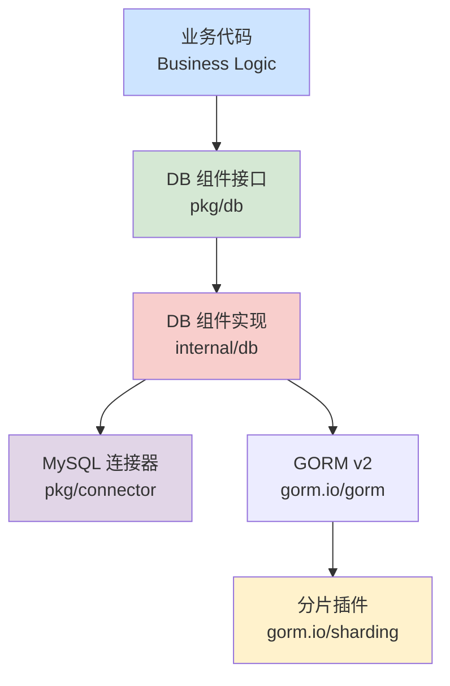

# 数据库组件 (DB Component) 设计文档

## 1. 目标与定位

本设计旨在构建一个**轻量级、高性能**的数据库组件，核心基于 `GORM v2` 和 `gorm.io/sharding` 插件。

**核心设计理念：**

1. **原生体验 (Native Experience):** 保持 GORM 的原汁原味。用户主要通过 `*gorm.DB` 进行操作，无额外的学习成本。
2. **无侵入分片 (Non-intrusive Sharding):** 利用 `gorm.io/sharding` 插件实现分库分表。配置即生效，业务代码无需感知分片逻辑（前提是带上分片键）。
3. **高性能 (High Performance):** 基于 SQL 解析和替换，无网络中间件开销，性能接近原生 Go。
4. **统一事务 (Unified Transaction):** 提供简单的闭包接口管理事务生命周期。

## 2. 架构设计

### 2.1. 模块位置与依赖



### 2.2. 核心接口定义 (`pkg/db`)

接口保持极简，只暴露获取 DB 实例和事务方法。

```go
package db

import (
    "context"
    "gorm.io/gorm"
)

// DB 定义了数据库组件的核心能力
type DB interface {
    // DB 获取底层的 *gorm.DB 实例
    // 绝大多数业务查询直接使用此方法返回的对象
    DB(ctx context.Context) *gorm.DB
    
    // Transaction 执行事务操作
    // fn 中的 tx 对象仅在当前事务范围内有效
    Transaction(ctx context.Context, fn func(ctx context.Context, tx *gorm.DB) error) error
    
    // Close 关闭组件
    Close() error
}
```

## 3. 详细设计

### 3.1. 配置设计

配置设计直接映射 `gorm.io/sharding` 的核心参数，支持灵活定义不同表的分片规则。

```go
// pkg/db/config.go

type Config struct {
    // 是否开启分片特性
    EnableSharding bool `json:"enable_sharding" yaml:"enable_sharding"`
    
    // 分片规则配置列表
    // 允许为不同的表组配置不同的分片规则
    ShardingRules []ShardingRule `json:"sharding_rules" yaml:"sharding_rules"`
}

type ShardingRule struct {
    // 分片键 (例如 "user_id")
    ShardingKey string `json:"sharding_key" yaml:"sharding_key"`
    
    // 分片数量 (例如 64)
    NumberOfShards uint `json:"number_of_shards" yaml:"number_of_shards"`
    
    // 应用此规则的逻辑表名列表 (例如 ["orders", "audit_logs"])
    Tables []string `json:"tables" yaml:"tables"`
}
```

### 3.2. 实现逻辑 (`internal/db`)

在初始化阶段，根据配置注册 `sharding` 中间件。

```go
// internal/db/db.go (伪代码)

func New(conn connector.MySQLConnector, cfg *Config) (db.DB, error) {
    gormDB := conn.GetClient()
    
    // 注册分片中间件
    if cfg.EnableSharding && len(cfg.ShardingRules) > 0 {
        for _, rule := range cfg.ShardingRules {
            // 将字符串表名转换为 interface{} 切片以适配 Register 方法
            tables := make([]interface{}, len(rule.Tables))
            for i, v := range rule.Tables {
                tables[i] = v
            }

            middleware := sharding.Register(sharding.Config{
                ShardingKey:         rule.ShardingKey,
                NumberOfShards:      rule.NumberOfShards,
                PrimaryKeyGenerator: sharding.PKSnowflake, // 默认使用雪花算法
            }, tables...)
            
            gormDB.Use(middleware)
        }
    }
    
    return &database{client: gormDB}, nil
}
```

## 4. 使用示例

### 4.1. 分片表操作 (Sharding)

对于配置了分片的表，操作时**必须包含分片键**。

```go
// 假设 "orders" 表配置了按 "user_id" 分片，共 64 片

func (s *OrderService) CreateOrder(ctx context.Context, order *model.Order) error {
    // 插入操作：自动路由到 orders_xx 表
    // SQL: INSERT INTO orders_02 ... (假设 user_id % 64 = 2)
    return s.db.DB(ctx).Create(order).Error
}

func (s *OrderService) GetUserOrders(ctx context.Context, userID int64) ([]model.Order, error) {
    var orders []model.Order
    // 查询操作：必须包含 user_id 条件
    // SQL: SELECT * FROM orders_02 WHERE user_id = 2
    err := s.db.DB(ctx).Where("user_id = ?", userID).Find(&orders).Error
    return orders, err
}

func (s *OrderService) DeleteOrder(ctx context.Context, userID int64, productID int64) error {
    // 删除操作：必须包含 user_id 条件
    // SQL: DELETE FROM orders_02 WHERE user_id = 2 AND product_id = 100
    return s.db.DB(ctx).Where("user_id = ? AND product_id = ?", userID, productID).Delete(&model.Order{}).Error
}
```

**注意：** 如果操作分片表时未提供分片键，将返回 `ErrMissingShardingKey` 错误。

```go
// 错误示例：缺少分片键
// Error: sharding: missing sharding key
err := s.db.DB(ctx).Where("product_id = ?", 100).Find(&orders).Error
```

### 4.2. 普通表操作

对于未配置分片的表，使用方式与标准 GORM 完全一致。

```go
func (s *ProductService) GetProduct(ctx context.Context, id int64) (*model.Product, error) {
    var product model.Product
    err := s.db.DB(ctx).First(&product, id).Error
    return &product, err
}
```

### 4.3. 事务操作

事务支持与分片插件无缝集成。

```go
func (s *OrderService) CreateOrderTx(ctx context.Context, order *model.Order) error {
    return s.db.Transaction(ctx, func(ctx context.Context, tx *gorm.DB) error {
        // 在事务中插入分片表
        if err := tx.Create(order).Error; err != nil {
            return err
        }
        
        // 在事务中更新普通表
        // ...
        
        return nil
    })
}
```

## 5. 总结

本设计充分利用了 `gorm.io/sharding` 的优势：

* **配置驱动**: 通过简单的配置即可开启分片，无需修改业务代码结构。
* **高性能**: 基于 SQL 解析的路由机制，效率极高。
* **灵活性**: 支持为不同表指定不同的分片键和分片数量。
* **一致性**: 无论是分片表还是普通表，都通过统一的 `*gorm.DB` 接口访问，体验一致。
