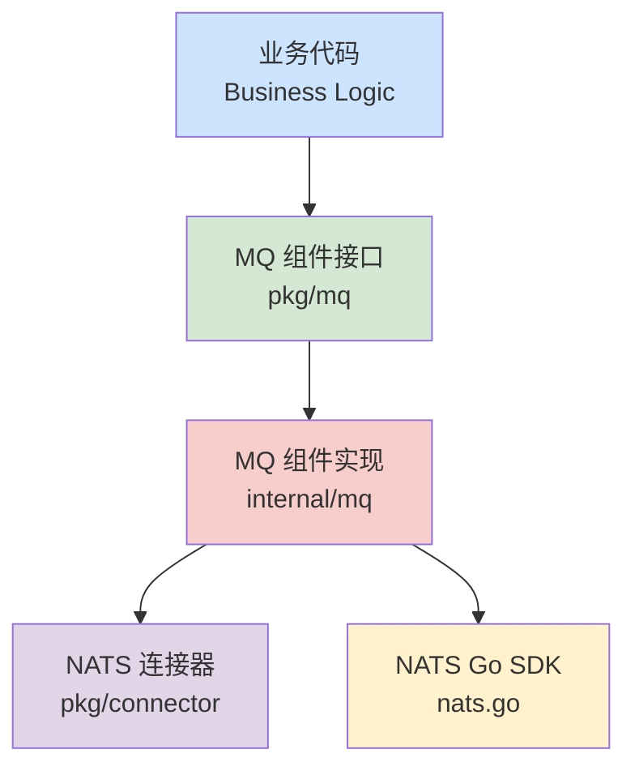

# 消息队列组件 (MQ Component) 设计文档

## 1. 目标与定位

本设计旨在构建一个**通用、灵活且高性能**的消息队列组件。当前阶段核心基于 `NATS` 实现，支持 **Core (即时通信)** 和 **JetStream (持久化流)** 两种模式，并为未来扩展其他中间件（如 Kafka）预留接口兼容性。

**核心设计理念：**

1. **统一抽象 (Unified Abstraction):** 屏蔽底层驱动差异，提供统一的 `Publish/Subscribe` 语义。
2. **模式灵活 (Dual Mode):**
    * **Core 模式:** 适用于高吞吐、低延迟、允许少量丢消息的场景（如实时指标、日志、服务发现）。
    * **JetStream 模式:** 适用于高可靠、持久化、不仅丢消息的场景（如订单处理、状态机流转）。
3. **开箱即用 (Out-of-the-box):** 简化复杂的配置，提供合理的默认值。
4. **平滑迁移 (Smooth Migration):** 接口设计考虑到 Kafka 等流式系统的特性，减少未来技术栈切换的成本。

## 2. 架构设计

### 2.1. 模块位置与依赖



### 2.2. 核心接口定义 (`pkg/mq`)

接口设计遵循 "最小通用集" 原则，同时保留必要的扩展性。

```go
package mq

import (
    "context"
    "time"
)

// Message 消息接口
// 封装了底层消息的细节，提供统一的数据访问和确认机制
type Message interface {
    // Subject 获取消息主题
    Subject() string
    
    // Data 获取消息内容
    Data() []byte
    
    // Ack 确认消息处理成功 (仅 JetStream 模式有效，Core 模式下为空操作)
    Ack() error
    
    // Nak 否认消息，请求重投 (仅 JetStream 模式有效)
    Nak() error
}

// Handler 消息处理函数
type Handler func(ctx context.Context, msg Message) error

// Subscription 订阅句柄
// 用于管理订阅的生命周期（如取消订阅）
type Subscription interface {
    // Unsubscribe 取消订阅
    Unsubscribe() error
    
    // IsValid 检查订阅是否有效
    IsValid() bool
}

// Client 定义了 MQ 组件的核心能力
type Client interface {
    // Publish 发送消息
    // 在 Core 模式下是发后即忘；在 JetStream 模式下会等待持久化确认
    Publish(ctx context.Context, subject string, data []byte) error
    
    // Subscribe 广播订阅
    // 所有订阅该 Subject 的消费者都会收到消息
    // 适用于：配置更新通知、缓存失效通知
    Subscribe(ctx context.Context, subject string, handler Handler) (Subscription, error)
    
    // QueueSubscribe 队列订阅 (负载均衡)
    // 同一个 queue 组内的消费者，每条消息只会被其中一个处理
    // 适用于：任务分发、订单处理
    // 对应 Kafka 的 Consumer Group 概念
    QueueSubscribe(ctx context.Context, subject string, queue string, handler Handler) (Subscription, error)
    
    // Request 请求-响应 (RPC 模式)
    // 发送消息并等待响应。
    // 注意：此功能是 NATS Core 的强项。如果未来切换 Kafka，此接口可能难以高效实现或不支持。
    Request(ctx context.Context, subject string, data []byte, timeout time.Duration) (Message, error)
    
    // Close 关闭客户端
    Close() error
}
```

## 3. 详细设计

### 3.1. 配置设计

配置需要区分驱动类型（Core vs JetStream）以及各自的特有参数。

```go
// pkg/mq/config.go

type DriverType string

const (
    DriverNatsCore      DriverType = "nats_core"
    DriverNatsJetStream DriverType = "nats_jetstream"
)

type Config struct {
    // 驱动类型
    Driver DriverType `json:"driver" yaml:"driver"`
    
    // JetStream 特有配置 (仅当 Driver 为 nats_jetstream 时有效)
    JetStream *JetStreamConfig `json:"jetstream" yaml:"jetstream"`
}

type JetStreamConfig struct {
    // 是否自动创建 Stream (如果不存在)
    AutoCreateStream bool `json:"auto_create_stream" yaml:"auto_create_stream"`
    
    // 默认的 Stream 配置 (用于自动创建)
    // 简单起见，可以约定 Subject 前缀映射到 Stream Name
    // 例如: "orders.>" -> Stream "ORDERS"
}
```

### 3.2. 实现逻辑 (`internal/mq`)

#### 3.2.1. NATS Core 实现

* **Publish:** 直接调用 `nc.Publish`。
* **Subscribe:** 调用 `nc.Subscribe`，在回调中封装 `Message` 并执行用户 Handler。
* **Ack/Nak:** 空操作（Core 模式不支持）。

#### 3.2.2. NATS JetStream 实现

* **Publish:** 调用 `js.Publish`，默认使用同步发送 (`Publish`) 以确保持久化，或者提供异步选项 (`PublishAsync`)。
* **Subscribe:**
  * 使用 `js.Subscribe` (Push Consumer)。
  * **Ack 策略:** 默认 `AckExplicit` (显式确认)。
  * **Handler 包装:** 在调用用户 Handler 后，根据返回的 error 自动决定 Ack 或 Nak（也可以让用户在 Handler 内部手动 Ack，设计上需权衡）。
    * *推荐方案:* 自动 Ack。如果 Handler 返回 nil，自动 Ack；返回 error，自动 Nak。这样业务代码更简洁。

### 3.3. Kafka 兼容性考量

如果未来底层从 NATS 切换到 Kafka，以下是兼容性分析：

| 功能 | NATS (Current) | Kafka (Future) | 兼容性建议 |
| :--- | :--- | :--- | :--- |
| **Subject/Topic** | 支持层级 (`a.b.c`) 和通配符 (`*`, `>`) | 扁平结构，通常用 `-` 分隔 | **建议:** 尽量使用扁平命名，如 `order_created`，避免过度依赖 NATS 的复杂通配符路由。 |
| **Payload** | 二进制 `[]byte` | 二进制 `[]byte` | 完全兼容。 |
| **Subscribe (广播)** | 原生支持 | 需要为每个实例生成唯一的 Consumer Group ID | 接口层可以自动处理 Group ID 生成，对业务透明。 |
| **QueueSubscribe** | 原生支持 (Queue Group) | 原生支持 (Consumer Group) | 概念完美映射。**这是微服务最常用的模式。** |
| **Request/Reply** | 原生高性能支持 | **不支持** (需通过回执 Topic 模拟，延迟高) | **警告:** 尽量仅将 MQ 用于异步解耦。如果必须用 RPC，建议走 gRPC/HTTP 而不是 MQ。 |
| **持久化** | Core (无), JetStream (有) | 默认持久化 | 生产环境涉及重要数据务必使用 JetStream 模式。 |

## 4. 使用示例

### 4.1. 生产者

```go
func (s *OrderService) CreateOrder(ctx context.Context, order *model.Order) error {
    // 业务逻辑...
    
    // 发送事件
    payload, _ := json.Marshal(order)
    // Subject 建议使用 "资源.动作" 格式
    err := s.mq.Publish(ctx, "orders.created", payload)
    if err != nil {
        s.logger.Error("failed to publish order created event", err)
        // 根据业务需求决定是否回滚或重试
    }
    return nil
}
```

### 4.2. 消费者 (Worker)

```go
func (s *InventoryService) Start(ctx context.Context) {
    // 使用 QueueSubscribe 实现负载均衡
    // 所有 InventoryService 实例属于 "inventory_workers" 组
    // 只有其中一个会收到消息
    sub, err := s.mq.QueueSubscribe(ctx, "orders.created", "inventory_workers", s.handleOrderCreated)
    if err != nil {
        panic(err)
    }
    s.sub = sub
}

func (s *InventoryService) handleOrderCreated(ctx context.Context, msg mq.Message) error {
    var order model.Order
    json.Unmarshal(msg.Data(), &order)
    
    // 扣减库存逻辑...
    
    // 如果 Handler 返回 nil，组件会自动 Ack (JetStream 模式下)
    // 如果返回 error，组件会自动 Nak 触发重试
    return nil 
}
```

## 5. 总结

本设计通过定义清晰的接口，将 MQ 的使用模式标准化。

* **对于 NATS 用户:** 可以充分利用 Core 的极速和 JetStream 的可靠性。
* **对于未来架构:** 只要遵循 `QueueSubscribe` 为主的异步通信模式，未来迁移到 Kafka 或 Pulsar 将非常平滑。
