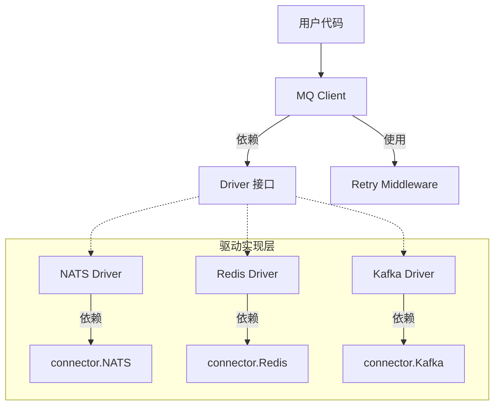

# MQ 组件重构设计文档 (RFC)

## 1. 背景与问题

当前 `mq` 组件存在以下问题（基于 Issue #14）：
1.  **强耦合 NATS**: `Client` 接口与 `connector.NATSConnector` 强绑定，无法扩展支持 Kafka、RabbitMQ 或 Redis Stream。
2.  **功能受限**: 仅支持 Handler 回调模式，缺乏 Channel 模式支持；缺乏应用层重试和死信队列（DLQ）机制。
3.  **配置僵化**: Driver 类型硬编码，无法灵活配置 Stream 参数。

## 2. 设计目标

1.  **Driver 抽象**: 引入 `Driver` 接口层，完全解耦 `Client` 与底层实现。
2.  **多协议支持**: 架构上支持 NATS (Core/JetStream), Kafka, Redis Stream 等多种后端。
3.  **易用性增强**: 支持 `SubscribeChan` (Channel 模式) 和 Options 模式。
4.  **可靠性增强**: 增加应用层重试 (`WithRetry`) 和 DLQ 支持。

## 3. 架构设计



## 4. 详细接口设计

### 4.1 Driver 接口 (`mq/driver.go`)

这是核心抽象层，所有具体 MQ 实现必须实现此接口。

```go
// Driver 定义底层 MQ 驱动的行为
type Driver interface {
    // Publish 发布消息
    // data: 消息体
    // opts: 发布选项（如延迟发送、优先级等，取决于实现）
    Publish(ctx context.Context, subject string, data []byte, opts ...PublishOption) error

    // Subscribe 订阅消息
    // handler: 收到消息后的回调
    // opts: 订阅选项（QueueGroup, AutoAck, etc.）
    Subscribe(ctx context.Context, subject string, handler Handler, opts ...SubscribeOption) (Subscription, error)

    // Close 关闭驱动资源
    Close() error
}
```

### 4.2 Client 接口增强 (`mq/mq.go`)

Client 层负责封装 Driver，提供更友好的 API（如 Channel 模式、Metrics、日志）。

```go
type Client interface {
    // 基础方法
    Publish(ctx context.Context, subject string, data []byte, opts ...PublishOption) error
    Subscribe(ctx context.Context, subject string, handler Handler, opts ...SubscribeOption) (Subscription, error)
    
    // 新增：Channel 模式
    // 返回一个只读 Channel，用户可以通过 range 遍历消息
    SubscribeChan(ctx context.Context, subject string, opts ...SubscribeOption) (<-chan Message, Subscription, error)
    
    Close() error
}

// 构造函数变更
// 之前: func New(conn connector.NATSConnector, ...)
// 之后: func New(driver Driver, opts ...Option)
```

### 4.3 订阅选项 (`mq/options.go`)

统一使用 Options 模式，不再区分 `Subscribe` 和 `QueueSubscribe` 方法名。

```go
type SubscribeOptions struct {
    QueueGroup  string // 负载均衡组 (对应 NATS Queue, Kafka Consumer Group)
    AutoAck     bool   // 是否自动确认 (默认 true)
    DurableName string // 持久化订阅名 (JetStream/Redis Group)
    BufferSize  int    // Channel 模式的缓冲区大小
}

func WithQueueGroup(name string) SubscribeOption
func WithDurable(name string) SubscribeOption
func WithManualAck() SubscribeOption // 关闭自动 Ack
```

### 4.4 重试机制 (`mq/retry.go`)

```go
// HandlerMiddleware 定义处理函数中间件
type HandlerMiddleware func(Handler) Handler

// WithRetry 提供指数退避重试
func WithRetry(attempts int, initialBackoff time.Duration) HandlerMiddleware {
    return func(next Handler) Handler {
        return func(ctx context.Context, msg Message) error {
            // ... loop with backoff ...
        }
    }
}
```

## 5. 目录结构变更

```text
mq/
├── mq.go              # Client 接口定义
├── client.go          # Client 实现 (原 impl.go)
├── driver.go          # Driver 接口定义 (新)
├── driver_nats.go     # NATS 驱动实现 (新)
├── driver_redis.go    # Redis 驱动实现 (未来扩展)
├── options.go         # Options 定义
├── retry.go           # 重试逻辑 (新)
└── config.go          # 配置定义
```

## 6. 迁移指南

**Breaking Changes**:
1. `mq.New` 签名改变，需先构造 Driver。
2. `QueueSubscribe` 方法移除，改为 `Subscribe(..., WithQueueGroup("group"))`。

**升级示例**:

```go
// 旧代码
client, _ := mq.New(natsConn, cfg)
client.QueueSubscribe(ctx, "topic", "group", handler)

// 新代码
driver, _ := mq.NewNatsDriver(natsConn, mq.NatsConfig{...})
client, _ := mq.New(driver)
client.Subscribe(ctx, "topic", handler, mq.WithQueueGroup("group"))
```
