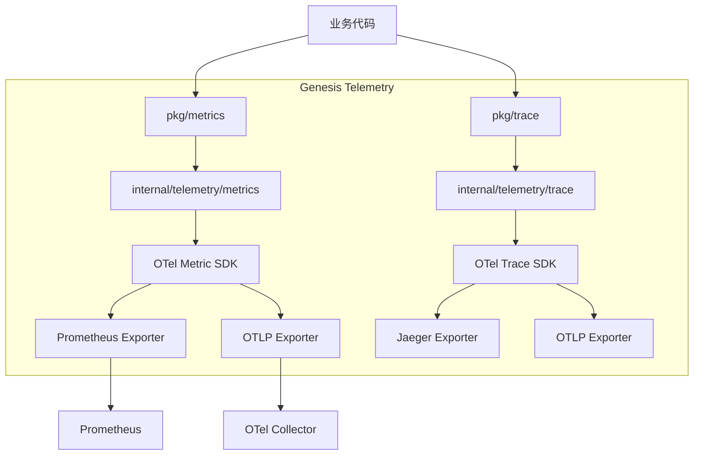

# Telemetry (Metrics & Tracing) 设计文档

## 1. 目标与愿景

随着微服务架构的演进，可观测性 (Observability) 已成为系统稳定性的基石。Genesis 框架旨在提供一套**开箱即用、统一标准、底层无感**的监控与链路追踪方案。

**核心目标：**

1. **统一标准 (Standardization):** 基于 **OpenTelemetry (OTel)** 标准构建，确保与云原生生态（Prometheus, Grafana, Jaeger, OTLP）的无缝集成。
2. **极简接口 (Simplicity):** 屏蔽 OTel SDK 的复杂性，提供符合 Genesis 风格（Interface-Driven）的极简 API。
3. **深度集成 (Integration):** 与 `clog` (日志)、`connector` (数据库/缓存) 和 `transport` (HTTP/gRPC) 深度打通，实现 Log-Metric-Trace 的自动关联。
4. **零侵入 (Zero Intrusion):** 通过中间件和拦截器实现自动埋点，业务代码只需关注自定义指标。

## 2. 核心概念辨析：Tracing vs Logging

在设计之前，我们需要明确 **Tracing (链路追踪)** 和 **Logging (日志)** 的关系，这也是 `clog` 与 `telemetry` 组件交互的基础。

| 特性 | Tracing (链路追踪) | Logging (日志) |
| :--- | :--- | :--- |
| **核心职责** | **生成与记录上下文**。它负责生成唯一的 `TraceID`，记录请求在各个服务间的调用路径、耗时和依赖关系。 | **记录离散事件**。它负责记录程序运行时的状态、错误和调试信息。 |
| **数据形态** | 结构化的 Spans (包含 StartTime, EndTime, ParentID)。 | 文本或结构化的 Log Entries。 |
| **角色** | **生产者 (Producer)**。它创造了 Context。 | **消费者 (Consumer)**。它从 Context 中提取 `TraceID` 用于关联。 |

**结论：**
`clog` 能从 Context 中提取 `trace_id` 的前提是，**Tracing 系统已经初始化并将 Trace 信息注入到了 Context 中**。如果没有 Tracing 组件，`clog` 提取到的将是空值。因此，二者是**协同工作**而非替代关系。

## 3. 架构设计

### 3.1. 分层架构

遵循 Genesis 的分层设计原则，将 API 定义与底层实现分离。
Í



### 3.2. 目录结构

```text
genesis/
├── pkg/
│   ├── metrics/            # 指标 API
│   │   ├── api.go          # 核心接口 (Counter, Gauge, Histogram)
│   │   └── global.go       # 全局访问入口 (可选)
│   └── trace/              # 链路追踪 API
│       ├── api.go          # 核心接口 (Tracer, Span)
│       └── context.go      # Context 传播工具
├── internal/
│   └── telemetry/          # 内部实现
│       ├── provider.go     # OTel Provider 初始化
│       ├── metrics/        # Metrics 实现
│       └── trace/          # Trace 实现
└── ...
```

## 4. Metrics 设计

### 4.1. 核心接口 (`pkg/metrics`)

为了降低学习成本，我们只暴露最常用的三种指标类型，并统一使用 `Label` (即 Tag/Attribute) 进行维度划分。

```go
package metrics

import "context"

// Meter 是指标的创建工厂
type Meter interface {
    Counter(name string, desc string, opts ...Option) (Counter, error)
    Gauge(name string, desc string, opts ...Option) (Gauge, error)
    Histogram(name string, desc string, opts ...Option) (Histogram, error)
}

// Counter 累加器 (如：请求数、错误数)
type Counter interface {
    Inc(ctx context.Context, labels ...Label)
    Add(ctx context.Context, val float64, labels ...Label)
}

// Gauge 仪表盘 (如：内存使用率、Goroutine 数量)
type Gauge interface {
    Set(ctx context.Context, val float64, labels ...Label)
    Record(ctx context.Context, val float64, labels ...Label) // 同 Set
}

// Histogram 直方图 (如：请求耗时分布)
type Histogram interface {
    Record(ctx context.Context, val float64, labels ...Label)
}

// Label 定义指标的维度
type Label struct {
    Key   string
    Value string
}
```

### 4.2. 使用示例

```go
// 初始化 (通常在全局或 Component 中)
reqCounter, _ := meter.Counter("http_requests_total", "Total HTTP requests")

// 业务中使用
func HandleRequest(ctx context.Context) {
    // ... 业务逻辑 ...
    
    // 记录指标
    reqCounter.Inc(ctx, 
        metrics.Label{Key: "method", Value: "POST"},
        metrics.Label{Key: "status", Value: "200"},
    )
}
```

## 5. Tracing 设计

### 5.1. 核心接口 (`pkg/trace`)

Tracing 的核心在于 `Context` 的传递和 `Span` 的生命周期管理。

```go
package trace

import "context"

// Tracer 用于创建 Span
type Tracer interface {
    // Start 开启一个新的 Span
    // 如果 ctx 中已存在父 Span，则自动关联
    Start(ctx context.Context, operationName string, opts ...Option) (context.Context, Span)
}

// Span 代表链路中的一个操作单元
type Span interface {
    // End 结束 Span
    End()
    
    // SetStatus 设置状态 (如 Error)
    SetStatus(code StatusCode, msg string)
    
    // RecordError 记录错误事件
    RecordError(err error)
    
    // SetAttributes 设置属性
    SetAttributes(attrs ...Attribute)
    
    // TraceID 获取当前 TraceID (用于日志关联)
    TraceID() string
    
    // SpanID 获取当前 SpanID
    SpanID() string
}
```

### 5.2. 自动注入与提取 (Propagation)

Genesis 将内置对 HTTP Headers 和 gRPC Metadata 的支持，自动提取 `traceparent` 等标准头，确保跨服务链路不断裂。

```go
// 客户端注入
ctx = trace.Inject(ctx, header)

// 服务端提取
ctx = trace.Extract(ctx, header)
```

## 6. 配置设计 (`config.yaml`)

统一的配置入口，支持分别开启 Metrics 和 Tracing，并配置 Exporter。

```yaml
telemetry:
  service_name: "order-service"
  version: "v1.0.0"
  
  metrics:
    enabled: true
    # exporter: "prometheus" | "otlp" | "stdout"
    exporter: "prometheus" 
    prometheus:
      port: 9090
      path: "/metrics"
      
  trace:
    enabled: true
    # exporter: "jaeger" | "otlp" | "stdout" | "zipkin"
    exporter: "otlp"
    otlp:
      endpoint: "otel-collector:4317"
      protocol: "grpc" # grpc | http
    sampler:
      type: "ratio" # always | never | ratio
      param: 1.0    # 采样率 100%
```

## 7. 生态集成 (Integration)

这是 Genesis Telemetry 设计的亮点，通过框架层面的打通，实现“一次接入，全链路可视”。

### 7.1. 与 `clog` 集成 (Log Correlation)

`clog` 将自动检测 `context.Context` 中的 Trace 信息。当日志打印时，自动附加 `trace_id` 和 `span_id` 字段。

* **效果：** 在 Grafana/Kibana 中查看日志时，可以直接跳转到对应的 Trace 详情页。

### 7.2. 与 `connector` 集成

所有 Genesis 标准连接器 (MySQL, Redis, RPC) 将内置 Interceptor。

* **DB:** 自动记录 SQL 语句、执行耗时、数据库实例信息到 Span。
* **Redis:** 自动记录命令、Key (脱敏)、耗时到 Span。
* **Metrics:** 自动上报连接池状态 (Idle, InUse, Wait) 指标。

### 7.3. 与 `container` 集成

Telemetry 组件作为 `container` 的一部分，拥有最高的启动优先级 (Phase 0)，确保在其他组件启动前就绪，从而能够监控到应用启动的全过程。

## 8. 演进路线

* **Phase 1 (基础):** 定义 API，实现基于 OTel 的 Metrics (Prometheus) 和 Trace (Stdout/Jaeger)。
* **Phase 2 (集成):** 实现 `clog` 自动关联，实现 HTTP/gRPC 中间件。
* **Phase 3 (增强):** 实现 DB/Redis 连接器的自动埋点，支持 OTLP Exporter。
