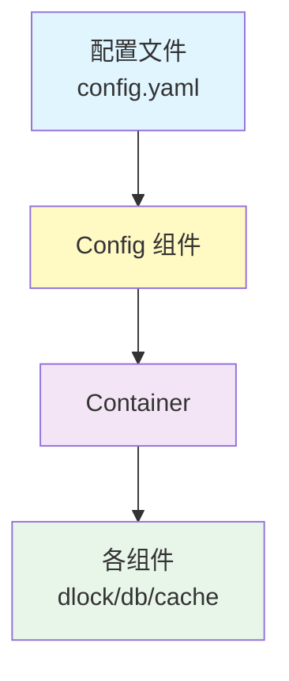

# Genesis 设计文档审查与改进建议

## 一、整体评估

经过仔细审查，我发现当前设计存在以下**核心问题**：

### 1. **初始化路径不统一** ⚠️

- 文档中既提到"从 Container 获取"，又提供"独立初始化"的工厂函数
- 缺乏明确的**使用场景区分**和**最佳实践指导**

### 2. **日志注入机制不完善** ⚠️

- 各组件文档未统一说明如何注入 Logger
- 缺少 **Namespace 传递链路**的设计（如 `user-service.dlock.redis`）

### 3. **配置管理流程模糊** ⚠️

- 未明确说明 Config 组件的角色和使用时机
- 业务代码、Container、组件三者之间的配置传递关系不清晰

### 4. **可观测性设计不完整** ⚠️

- Metrics、Tracing 的集成点未规划
- 缺少统一的埋点规范

---

## 二、改进方案

### 🎯 方案 1：统一初始化路径（推荐）

#### 核心原则

```
所有组件必须通过 Container 初始化，禁止业务代码直接调用工厂函数
```

#### 设计理念

1. **Container 是唯一入口**：确保依赖关系清晰、生命周期可控
2. **工厂函数仅供 Container 调用**：位于 `internal/` 包，业务代码不可见
3. **测试场景例外**：单元测试可通过 Mock 接口绕过 Container

#### 目录结构调整

```text
genesis/
├── pkg/
│   ├── container/
│   │   ├── container.go          # 核心容器
│   │   └── builder.go            # 流式构建器
│   ├── dlock/
│   │   └── types/
│   │       └── interface.go      # 仅暴露接口
│   └── config/
│       ├── config.go             # 配置管理器接口
│       └── types/
│           └── interface.go
├── internal/
│   ├── dlock/
│   │   └── factory.go            # 工厂函数（不对外暴露）
│   └── config/
│       └── loader.go             # 配置加载实现
```

#### 使用示例

```go
// ❌ 错误：业务代码直接初始化
func main() {
    lock := dlock.New(cfg) // 不允许
}

// ✅ 正确：通过 Container 初始化
func main() {
    // 1. 加载配置
    cfg := config.Load("config.yaml")
    
    // 2. 构建容器
    container := genesis.NewContainer(
        genesis.WithConfig(cfg),
        genesis.WithLogger(logger),
    )
    
    // 3. 启动容器（自动初始化所有组件）
    if err := container.Start(context.Background()); err != nil {
        log.Fatal(err)
    }
    defer container.Stop(context.Background())
    
    // 4. 从容器获取组件
    dlock := container.DLock()
    db := container.DB()
}
```

---

### 🎯 方案 2：双路径设计（灵活但需严格规范）

#### 适用场景

| 场景 | 初始化方式 | 说明 |
|------|-----------|------|
| **生产环境** | Container | 统一管理、生命周期可控 |
| **单元测试** | 工厂函数 | 快速构造、独立测试 |
| **工具脚本** | 工厂函数 | 轻量级、无需完整容器 |

#### 设计约束

```go
// pkg/dlock/dlock.go
package dlock

// New 创建独立实例（仅用于测试或工具脚本）
// 警告：生产环境请使用 Container.DLock()
func New(connector connector.Redis, cfg *types.Config, logger clog.Logger) (types.Locker, error) {
    // 实现...
}
```

#### 文档规范

每个组件文档必须包含以下章节：

```markdown
## 使用方式

### 生产环境（推荐）
通过 Container 获取实例，享受统一的生命周期管理和依赖注入。

### 测试环境
可使用 `New()` 工厂函数快速构造实例，但需手动管理资源释放。

### ⚠️ 注意事项
- 生产代码禁止直接调用 `New()`
- 独立实例不受 Container 生命周期管理
```

---

## 三、日志注入设计

### 核心机制：Namespace 继承链

```go
// pkg/clog/types/interface.go
type Logger interface {
    WithNamespace(parts ...string) Logger
    // ...
}

// 使用示例
appLogger := clog.New(clog.Config{Namespace: "user-service"})

// Container 初始化时传递
container := genesis.NewContainer(
    genesis.WithLogger(appLogger),
)

// 组件自动继承并扩展 Namespace
// user-service -> user-service.dlock -> user-service.dlock.redis
dlockLogger := appLogger.WithNamespace("dlock")
redisLogger := dlockLogger.WithNamespace("redis")
```

### 组件工厂函数签名统一

```go
// internal/dlock/factory.go
func New(
    connector connector.Redis,
    cfg *types.Config,
    logger clog.Logger, // 必须参数
) (types.Locker, error) {
    // 自动扩展 Namespace
    componentLogger := logger.WithNamespace("dlock")
    
    return &redisLocker{
        conn:   connector,
        logger: componentLogger,
    }, nil
}
```

### Container 注入规范

```go
// pkg/container/container.go
type Container struct {
    logger clog.Logger
    // ...
}

func (c *Container) initDLock() error {
    // 自动注入带 Namespace 的 Logger
    c.dlock, err = dlockFactory.New(
        c.redisConnector,
        c.config.DLock,
        c.logger.WithNamespace("dlock"), // 自动扩展
    )
    return err
}
```

---

## 四、配置管理流程

### 推荐架构



### 设计原则

1. **业务代码不直接读配置**

   ```go
   // ❌ 错误
   func main() {
       cfg := viper.ReadConfig("config.yaml")
       dlock := dlock.New(cfg.DLock)
   }
   
   // ✅ 正确
   func main() {
       container := genesis.LoadFromConfig("config.yaml")
       dlock := container.DLock()
   }
   ```

2. **Config 组件职责**
   - 加载配置文件（支持 YAML/JSON/ENV）
   - 验证配置完整性
   - 提供类型安全的访问接口

3. **Container 职责**
   - 接收 Config 实例
   - 将配置分发给各组件
   - 管理组件生命周期

### 配置结构设计

```go
// pkg/config/types/config.go
type Config struct {
    App struct {
        Name      string `yaml:"name"`
        Namespace string `yaml:"namespace"` // 用于日志
    } `yaml:"app"`
    
    Connectors struct {
        Redis map[string]connector.RedisConfig `yaml:"redis"`
        MySQL map[string]connector.MySQLConfig `yaml:"mysql"`
    } `yaml:"connectors"`
    
    Components struct {
        DLock      dlock.Config      `yaml:"dlock"`
        DB         db.Config         `yaml:"db"`
        Cache      cache.Config      `yaml:"cache"`
        RateLimit  ratelimit.Config  `yaml:"ratelimit"`
    } `yaml:"components"`
}
```

### 配置文件示例

```yaml
app:
  name: user-service
  namespace: user-service

connectors:
  redis:
    default:
      addr: localhost:6379
      db: 0
  mysql:
    primary:
      dsn: "user:pass@tcp(localhost:3306)/db"

components:
  dlock:
    backend: redis
    redis_connector: default
    prefix: "dlock:"
    default_ttl: 30s
  
  db:
    enable_sharding: true
    sharding_rules:
      - sharding_key: user_id
        number_of_shards: 64
        tables: [orders, payments]
```

---

## 五、可观测性设计

### 统一埋点规范

```go
// pkg/observability/types/interface.go
type Metrics interface {
    Counter(name string, tags ...string) Counter
    Gauge(name string, tags ...string) Gauge
    Histogram(name string, tags ...string) Histogram
}

// 组件集成示例
type redisLocker struct {
    conn    connector.Redis
    logger  clog.Logger
    metrics observability.Metrics // 新增
}

func (l *redisLocker) Lock(ctx context.Context, key string) error {
    start := time.Now()
    defer func() {
        l.metrics.Histogram("dlock.lock.duration").Observe(
            time.Since(start).Seconds(),
            "backend", "redis",
            "result", "success",
        )
    }()
    
    l.logger.InfoContext(ctx, "acquiring lock", 
        clog.String("key", key),
    )
    // ...
}
```

### Metrics 命名规范

```
<namespace>.<component>.<operation>.<metric_type>

示例：
- user-service.dlock.lock.duration
- user-service.dlock.lock.errors_total
- user-service.db.query.duration
- user-service.cache.hit_rate
```

---

## 六、文档改进建议

### genesis-design.md 需补充

```markdown
## 5. 使用规范

### 5.1. 初始化流程
1. 加载配置文件
2. 创建 Container 实例
3. 启动 Container（自动初始化所有组件）
4. 从 Container 获取组件实例

### 5.2. 日志规范
- 所有组件必须接收 Logger 参数
- 自动继承并扩展 Namespace
- 格式：`<app>.<component>.<subcomponent>`

### 5.3. 配置管理
- 业务代码不直接读取配置
- 通过 Container 统一分发
- 支持环境变量覆盖

### 5.4. 可观测性
- 内置 Metrics 埋点
- 统一的 Tracing Context 传递
- 结构化日志输出
```

### connector-design.md 需补充

```markdown
## 4.3. Logger 注入
所有 Connector 实现必须接收 Logger 参数：

```go
func NewRedisConnector(
    cfg *types.RedisConfig,
    logger clog.Logger, // 必须
) (types.RedisConnector, error)
```

Logger 的 Namespace 由 Container 自动管理：

- `app.connector.redis.default`
- `app.connector.mysql.primary`

```

### 各组件文档统一模板

```markdown
# <组件名> 设计文档

## 1. 目标与原则
## 2. 架构设计
## 3. 核心 API
## 4. 配置设计
## 5. 使用方式
  ### 5.1. 生产环境（通过 Container）
  ### 5.2. 测试环境（独立初始化）
## 6. 可观测性
  ### 6.1. 日志规范
  ### 6.2. Metrics 指标
  ### 6.3. Tracing 集成
## 7. 最佳实践
## 8. 常见问题
```

---

## 七、总结与建议

### ✅ 推荐方案

**采用方案 1：统一通过 Container 初始化**

**理由：**

1. 大型项目必须有严格的依赖管理
2. 避免"两种初始化方式"带来的混乱
3. 便于统一注入 Logger、Metrics、Config
4. 测试场景可通过 Mock 接口解决

### 📋 待补充的设计文档

1. **config-design.md**
   - 配置加载机制
   - 环境变量覆盖规则
   - 配置热更新支持

2. **observability-design.md**
   - Metrics 规范
   - Tracing Context 传递
   - 日志聚合方案

3. **container-design.md**
   - 依赖注入机制
   - 生命周期编排
   - 启动顺序控制

### 🔧 需修改的现有文档

所有组件文档需统一添加：

- **使用规范**章节（明确只能通过 Container 获取）
- **日志注入**章节（说明 Namespace 继承）
- **可观测性**章节（Metrics 埋点说明）

---

**是否需要我提供具体的文档修改示例？**
