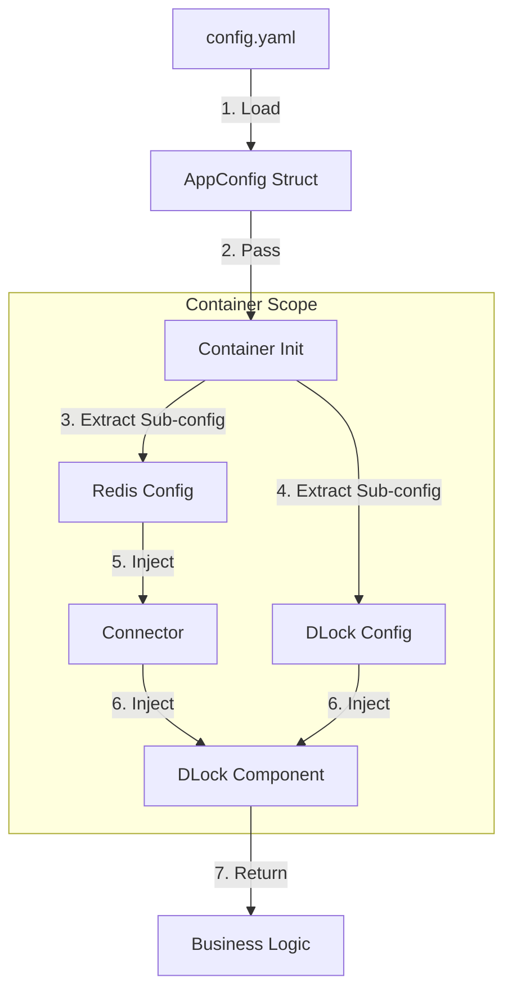

这是一个非常敏锐且切中要害的架构审查。你指出的问题正是许多微服务框架从“可用”走向“好用”和“企业级”时最容易忽视的**“最后一公里”——即组件的组装规范和可观测性的一致性**。

目前的 `genesis-design.md` 和 `connector-design.md` 搭建了很好的**骨架**（分层、接口隔离），但在**血肉连接**（如何统一初始化、日志/配置如何流动）上确实还不够严谨。

针对你的顾虑，目前的文档确实存在“各自为战”的风险。为了解决这个问题，我们需要制定一套**《Genesis 组件开发规范 (Component Specification)》**，并在所有组件文档中强制执行。

以下是针对你提出的初始化、日志注入、配置流向的**标准化重构建议**：

---

## 1. 初始化策略：独立与容器的统一辩证

**你的痛点：** 到底是“只能用 Container”还是“可以独立用”？
**建议方案：** 采用 **“组件独立纯粹，容器负责组装”** 的策略。

组件本身（如 `dlock`）**不应该知道** Container 的存在。它应该是一个标准的 Go Struct，可以通过构造函数直接初始化。Container 只是一个“高级胶水”，负责读取配置并调用这些构造函数。

### 规范定义

所有组件必须提供一个 `New` 工厂方法，且**必须**接受依赖注入（包括 Logger 和 Connector），而不是自己在内部创建。

*   ✅ **Good (依赖注入):**
    ```go
    // 允许在单元测试或简单脚本中独立使用
    func New(conn connector.RedisConnector, opts ...Option) (*Component, error)
    ```
*   ❌ **Bad (内部耦合):**
    ```go
    func New() *Component {
        // 错误：组件内部自己去读取全局配置或初始化连接
        conn := redis.NewClient(...) 
    }
    ```

**结论：** 组件**可以**独立初始化（便于测试和脚本编写），但在微服务应用中，**必须**通过 Container 统一管理生命周期。

---

## 2. 可观测性注入：日志与 Metrics 的“继承”

**你的痛点：** `user-service` 的日志注入到 `dlock` 后，应该体现层级（`user-service.dlock`）。
**建议方案：** 强制要求所有组件通过 `Option` 模式注入 `Logger`，并支持 Namespace 自动派生。

### 标准化接口设计

每个组件的 `Option` 中必须包含 `WithLogger`。如果用户不传，组件应回退到 `No-op Logger` (不打印) 或 `Default Logger`，但推荐强制注入。

```go
// pkg/dlock/options.go

type options struct {
    logger clog.Logger // 依赖接口，而非具体实现
    metrics Metrics    // 预留 Metrics 接口
}

func WithLogger(l clog.Logger) Option {
    return func(o *options) {
        // 关键点：组件收到 Logger 后，自动追加自己的组件名作为 Namespace
        o.logger = l.WithNamespace("dlock") 
    }
}
```

### 效果演示

当 Container 初始化 `dlock` 时：

```go
// internal/container/container.go

func (c *Container) initDLock() {
    // 假设 App Name 是 "user-service"
    // appLogger 的 namespace 已经是 "user-service"
    
    // 注入时，dlock 内部会自动变为 "user-service.dlock"
    lock, err := dlock.New(c.redisConn, dlock.WithLogger(c.appLogger))
}
```

这样，`dlock` 内部打印的日志 `Info("lock acquired")`，最终输出就是：
`level=info msg="lock acquired" namespace=user-service.dlock trace_id=...`

---

## 3. 配置流向：自顶向下的明确路径

**你的痛点：** 业务代码、Config、Container 谁先谁后？
**建议方案：** **Config (加载) -> Container (组装) -> Component (运行)**。

业务代码（`main.go`）**显式**感知配置结构，但**不感知**配置文件的解析逻辑（由配置库处理）。组件**完全不感知**配置文件的存在，只感知配置结构体。

### 启动流程规范 (The Genesis Bootstrap)



### 代码实现规范

1.  **Config 组件**：只定义结构体 tag（json/yaml）。
2.  **Main 函数**：
    ```go
    func main() {
        // 1. 加载配置 (业务代码感知配置)
        var cfg config.Config
        confLoader.Load("config.yaml", &cfg)

        // 2. 初始化全局 Logger
        logger := clog.New(cfg.Log)

        // 3. 初始化容器 (注入配置和 Logger)
        c := container.New(cfg, container.WithLogger(logger))
        
        // 4. 启动 (容器负责按顺序启动组件)
        if err := c.Start(); err != nil { ... }
        
        // 5. 业务逻辑从容器获取组件
        lock := c.DLock()
    }
    ```

---

## 4. 总结：需要补充的《组件设计公约》

为了响应你的需求，我们需要在现有的设计文档之上，补充一份**公约**，要求所有组件（Cache, MQ, DB 等）必须遵守：

| 规范领域 | 强制要求 (Must Have) | 目的 |
| :--- | :--- | :--- |
| **构造函数** | `New(Dependency, ...Option) (Interface, error)` | 确保可测试性，解耦配置源。 |
| **依赖注入** | 禁止在组件内部 `New` 连接器，必须通过参数传入接口。 | 确保连接复用，符合架构分层。 |
| **日志规范** | 提供 `WithLogger(clog.Logger)` 选项；<br>组件内部自动执行 `l.WithNamespace("组件名")`。 | 实现 `app.component` 的层级日志，便于排查。 |
| **配置规范** | 组件定义独立的 `Config` 结构体；<br>不直接读取文件，由调用者传入结构体。 | 明确配置边界，支持动态配置。 |
| **生命周期** | 实现 `Start(ctx)` 和 `Stop(ctx)` (如果需要后台任务)；<br>由 Container 统一编排调用顺序。 | 优雅停机，防止资源泄漏。 |
| **Metrics** | (未来规划) `Option` 中预留 `WithMetrics(Provider)`。 | 统一监控指标命名规范。 |

### 对现有文档的修改建议

1.  **修改 `genesis-design.md`**：新增一章 "Component Specification"，明确上述公约。
2.  **修改 `dlock/cache/mq` 等文档**：
    *   在 `New` 方法签名中增加 `logger` 的注入说明。
    *   明确说明 Namespace 的派生逻辑。
    *   移除任何暗示组件自己读取配置文件的描述。

这套规范一旦确立，你的 Genesis 框架将具备极强的一致性，无论是 5 个微服务还是 500 个微服务，维护体验都是统一的。