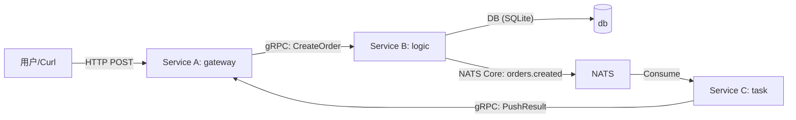
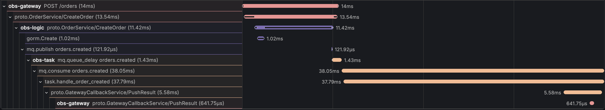

# Genesis Observability Demo

这是一个 **"全栈可观测性" (Full-Stack Observability)** 的演示项目，展示了如何在 Genesis 中打通 **Logging (日志)**、**Metrics (指标)** 和 **Tracing (链路追踪)** 三大支柱，并在 Grafana 中看到真实数据。

你可以把它当成一个“可观测性模范工程”的最小闭环：
- 真实三服务链路（HTTP + gRPC + DB + MQ + gRPC 回调）
- 指标能在 Prometheus/Grafana 看到（延迟/QPS/Go runtime/容器）
- 日志能在 Loki 检索，并用 `trace_id` 串起全链路
- Trace 能在 Tempo/Grafana 看到瀑布图，并且 MQ 侧保留 Span Link 语义（适配多消费者组/批消费的常见生产模式）

## 架构概览

本项目模拟一个“下单”业务的典型复杂链路（3 个服务 + MQ）：



数据流转：
- **Trace**：HTTP -> gRPC -> NATS -> gRPC 全链路透传 TraceContext（gRPC 自动、NATS 手动注入/提取），上报到 **Tempo**。
- **Metrics**：三服务分别暴露 `/metrics`，**Prometheus** 拉取，Grafana 展示。
- **Logs**：三服务日志输出到 stdout，**Alloy** 采集后写入 **Loki**。

## 快速开始（推荐：一键 Docker Compose）

在仓库根目录执行：

```bash
cd examples/observability
docker compose up -d --build
```

> 注意：本示例属于 Genesis 仓库的一部分，不是独立 Go Module，请不要在 `examples/observability` 下执行 `go mod init` / `go mod tidy`。

服务启动后：
- **Gateway (HTTP)**: http://localhost:8080
- **Gateway Callback (gRPC)**: localhost:9091
- **Logic (gRPC)**: localhost:9092
- **NATS**: localhost:4222
- **Prometheus**: http://localhost:9090
- **Grafana**: http://localhost:3000
- **Tempo (Ready)**: http://localhost:3200/ready（启动后前 ~15s 可能返回 503，随后变为 `ready`）
- **Loki**: http://localhost:3100

> 提示：`docker compose ps` 可以查看所有服务是否健康启动。

### 常用 Docker 操作（不重编译更快）

- 不 build 仅重启（例如只改了配置/只想重启基建）：  
  `docker compose restart prometheus grafana tempo loki alloy nats cadvisor`
- 不 build 但强制重建某个服务容器（例如改了 volumes/networking）：  
  `docker compose up -d --no-build --force-recreate logic`
- 查看日志：  
  `docker logs -f demo-gateway` / `docker logs -f demo-logic` / `docker logs -f demo-task`
- 查看 Alloy 日志（排查日志采集问题）：  
  `docker logs -f demo-alloy`

### 数据持久化（Docker volume）

本示例使用 Docker volume 持久化数据（避免映射到本地目录）：
- `tempo-data`：Tempo 的本地存储/WAL
- `logic-data`：SQLite 数据库文件

如需彻底清理数据（会丢数据）：`docker compose down -v`

## 产生真实数据

发送模拟下单请求：

```bash
curl -X POST http://localhost:8080/orders \
  -H "Content-Type: application/json" \
  -H "Authorization: Bearer demo-token" \
  -d '{"user_id":"1001", "product_id":"A001"}'
```

你会在容器日志中看到三段关键输出（同一条 trace 下）：
- gateway 收到请求并转发到 logic
- logic 落库后发布 NATS 消息
- task 消费消息并通过 gRPC 把结果推回 gateway（到达 A 即算成功）

压测（k6，默认带鉴权头）：

```bash
# 固定 5 QPS，持续 10 分钟
./bench/run-k6.sh
```

`run-k6.sh` 会优先使用本机 `k6`；若未安装，会自动使用 `grafana/k6` Docker 镜像运行。

工作日流量曲线压测（晨峰/午间回落/下午次峰/晚间回落）：

```bash
LOAD_PROFILE=weekday \
LOAD_WEEKDAY_STEP=3m \
LOAD_WEEKDAY_CYCLES=2 \
LOAD_PRE_ALLOCATED_VUS=1200 \
LOAD_MAX_VUS=6000 \
./bench/run-k6.sh
```

大流量波动压测（低/高水位循环）：

```bash
LOAD_PROFILE=wave \
LOAD_WAVE_LOW_RATE=300 \
LOAD_WAVE_HIGH_RATE=1200 \
LOAD_WAVE_CYCLES=12 \
LOAD_WAVE_RAMP=2m \
LOAD_WAVE_HOLD=8m \
LOAD_PRE_ALLOCATED_VUS=800 \
LOAD_MAX_VUS=4000 \
./bench/run-k6.sh
```

> `./bench/run-k6.sh` 会自动导出 JSON：  
> - 明细样本：`bench/results/metrics-<timestamp>.json`  
> - 汇总结果：`bench/results/summary-<timestamp>.json`  
> - 最新结果软指针：`bench/results/summary-latest.json`、`bench/results/run-latest.json`

常用参数：
> 注意：这里使用 `LOAD_` 前缀，避免与 k6 内置 `K6_` 环境变量冲突。

- `LOAD_PROFILE`: `fixed`（固定 QPS）/ `wave`（波动 QPS）/ `weekday`（工作日曲线）
- `LOAD_RATE`: 固定模式目标 QPS（默认 `5`）
- `LOAD_DURATION`: 固定模式持续时长（默认 `10m`）
- `LOAD_WAVE_LOW_RATE` / `LOAD_WAVE_HIGH_RATE`: 波动模式低/高水位 QPS
- `LOAD_WAVE_CYCLES`: 波动模式循环次数
- `LOAD_WEEKDAY_PATTERN`: 工作日曲线点位（逗号分隔 QPS 序列）
- `LOAD_WEEKDAY_STEP`: 工作日曲线每个点位持续时长（默认 `5m`）
- `LOAD_WEEKDAY_CYCLES`: 工作日曲线重复次数
- `LOAD_PRE_ALLOCATED_VUS` / `LOAD_MAX_VUS`: VU 预分配与上限（高 QPS 时建议提高）

## 如何验证

打开 **Grafana** (http://localhost:3000)：

## 三大支柱：能干嘛、怎么看

### 1) Metrics（指标）：看“系统整体健康”和趋势（告警主力）

**适合回答的问题**：
- 系统现在吞吐（QPS）是多少？是否抖动？
- 延迟（P95/P99）是否变差？
- 错误率是否升高？
- Go runtime / 容器资源是否异常（CPU、内存、Goroutine、GC）？

**本示例提供什么**：
- 业务 HTTP 指标（来自 `metrics` 组件 + 自定义直方图）：`http_request_duration_seconds_*`
- MQ 组件内置指标（来自 `mq` 组件）：`mq_publish_total`、`mq_consume_total`、`mq_handle_duration_seconds_*`
- Go runtime/进程指标（自动，无需手写）：`go_*`、`process_*`
- 容器指标（cAdvisor）：`container_*`

**Dashboard**：
- 打开 **Dashboards** → **"Observability Demo App"**
- 打开 **Dashboards** → **"Observability Demo - Runtime & cAdvisor"**

**P99 是怎么来的（核心概念）**：
- Prometheus 里直方图会暴露 `*_bucket / *_sum / *_count`
- P99 通常用 `histogram_quantile(0.99, sum(rate(<metric>_bucket[5m])) by (le, ...))` 计算

**常用 Prometheus 查询示例**：
- HTTP QPS：`rate(http_request_duration_seconds_count[1m])`
- HTTP P99：`histogram_quantile(0.99, sum(rate(http_request_duration_seconds_bucket[5m])) by (le, path))`
- MQ QPS（按 subject）：`sum(rate({__name__="mq.consume_total"}[1m])) by (subject)`
- MQ handler P99（按 subject）：`histogram_quantile(0.99, sum(rate({__name__="mq.handle.duration_seconds_bucket"}[5m])) by (le, subject))`
- Go runtime：`go_goroutines` / `go_memstats_heap_alloc_bytes`
- 容器 CPU：`rate(container_cpu_usage_seconds_total[1m])`

> 注意：这里的 “MQ Latency” 指的是“消费端 handler 处理耗时分布”（`mq_handle_duration_seconds`），不是“消息在队列里排队多久”。队列等待（queue delay）在纯 NATS Core 场景通常更建议用队列系统/应用侧指标做衡量。

### B. 链路（Tracing）
**适合回答的问题**：
- 这一次请求“慢在谁那里”？是 gateway、logic、DB、还是 task？
- 一条链路跨服务的时间分布是什么（瀑布图）？

**怎么找一条链路**：
1. 进入 **Explore** → 数据源选择 **Tempo**
2. 方式 A：按日志里的 `trace_id` 直接查 Trace
3. 方式 B：按 `service.name=obs-gateway|obs-logic|obs-task` 搜索（采样足够时更好用）

**怎么看瀑布图（waterfall）**：
- 顶部的 `obs-gateway POST /orders`：用户一次 HTTP 请求的同步耗时（关键路径）
- `proto.OrderService/CreateOrder`：gateway → logic 的 gRPC 调用（client/server 两端都会有 span）
- `gorm.Create`：DB 写入
- `mq.publish orders.created`：发布消息（Producer span）
- `mq.consume orders.created`：消费消息（Consumer span）
  - consumer span 上会有 **Span Link** 指向上游 producer span（更贴近生产中异步/批处理语义）
- `task.handle_order_created`：消费者内部业务处理
- `proto.GatewayCallbackService/PushResult`：task → gateway 回调（gRPC client/server）

示例截图（瀑布图）：



> 重要：异步链路（MQ → task → 回调）不会影响 HTTP 的同步耗时；你会看到它在时间轴上“更晚”开始。

### C. 日志（Logging）
**适合回答的问题**：
- 这条请求/消息“发生了什么细节”？具体哪个 order_id、哪个错误栈？
- Trace 已经告诉你“慢在 DB/MQ/某个 RPC”，日志用来补足细节上下文。

**怎么用 `trace_id` 串全链路**：
1. 进入 **Explore** → 数据源选择 **Loki**
2. 查询所有服务的同一条链路日志：
   - `{job="docker", service=~"gateway|logic|task"} | json | trace_id="xxxxxxxxxxxxxxxxxxxxxxxxxxxxxxxx"`

**常用查询**：
- 看 gateway 日志：`{job="docker", service="gateway"} | json`
- 看错误：`{job="docker", service=~"gateway|logic|task"} |= "level\":\"ERROR\""`
- 看某个订单：`{job="docker", service=~"gateway|logic|task"} | json | order_id="ORD-..."`（如果该日志行带这个字段）

> 如果日志没有显示，请先确认 Alloy 是否运行：`docker compose ps`。在 Docker Desktop 上如遇日志读取权限问题，可先用 `docker logs demo-gateway` 验证日志输出。

## 目录结构

- `config/`: Prometheus / Loki / Tempo / Grafana / Alloy 的配置
- `bench/`: k6 压测脚本、运行脚本、JSON 导出结果
- `proto/`: gRPC 定义及生成代码
- `docker-compose.yml`: 基础设施编排
- `cmd/gateway`: 服务 A（HTTP + gRPC 回调）
- `cmd/logic`: 服务 B（gRPC + SQLite + NATS Publish）
- `cmd/task`: 服务 C（NATS Consume + gRPC 回调）

## 常见问题（排障速查）

- **Tempo 查不到 trace**：确认 `curl http://localhost:3200/ready` 返回 `ready`；若 trace 产生时 Tempo 未启动，该 trace 不会补录。
- **Loki 里 `{job="docker", ...}` 查不到**：确认 Alloy 正常运行（`docker logs demo-alloy`），并且查询时间范围覆盖到 Alloy 生效之后的日志。
- **端口冲突（9090）**：Prometheus 占用宿主机 `9090`，logic gRPC 映射到宿主机 `9092`。
