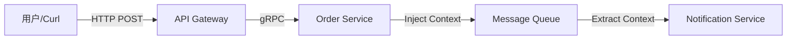

# Genesis Observability Demo

这是一个 **"全栈可观测性" (Full-Stack Observability)** 的演示项目，展示了如何在 Genesis 框架中无缝集成 **Logging (日志)**、**Metrics (指标)** 和 **Tracing (链路追踪)** 三大支柱。

## 架构概览

本项目模拟了一个典型的微服务调用链路：



核心特性：
-   **TraceID 贯穿**：TraceID 从 HTTP 入口生成，经由 gRPC 透传，最后通过 MQ 消息头跨进程传递到消费者，实现全链路闭环。
-   **日志联动**：`clog` 自动将 TraceID/SpanID 注入日志，在 Grafana 中可直接从 Trace 跳转到 Log。
-   **指标全覆盖**：包含 HTTP QPS/Latency、MQ 处理耗时、gRPC 内部指标以及 Go Runtime 监控。

## 快速开始

### 1. 启动基础设施

我们使用 Docker Compose 启动一套完整的 LGTM (Loki, Grafana, Tempo, Prometheus) 技术栈。

```bash
cd examples/observability
docker compose up -d
```

启动后，你可以访问：
-   **Grafana**: http://localhost:3000 (可视化面板)
-   **Prometheus**: http://localhost:9090 (指标查询)
-   **Tempo/Loki**: 后台运行，接收数据

### 2. 运行演示应用

```bash
# 回到项目根目录，或者直接在 examples/observability 下
go run main.go
```

应用启动后会监听：
-   `:8080` (HTTP Gateway)
-   `:9090` (gRPC Service)

### 3. 产生流量

发送一个模拟下单请求：

```bash
curl -X POST http://localhost:8080/orders \
  -H "Content-Type: application/json" \
  -d '{"user_id":"1001", "product_id":"A001"}'
```

你会看到控制台输出带有 `trace_id` 的日志。

## 如何验证

打开 **Grafana** (http://localhost:3000)：

### A. 查看仪表盘 (Metrics)
我们已经预置了 **"Observability Demo App"** 面板，点击 Dashboards 即可看到 HTTP QPS 和 P99 延迟。

**🔥 进阶玩法**：建议导入以下社区精品面板（点击 `+` -> `Import`）：
-   **ID 10826**: Go Metrics (监控 Goroutine, GC, Memory)
-   **ID 14282**: Docker cAdvisor (监控容器 CPU/内存)

### B. 查看链路 (Tracing)
1.  进入 **Explore** 页面。
2.  数据源选择 **Tempo**。
3.  输入控制台日志中的 `trace_id`。
4.  你会看到一条完整的瀑布图：Gateway -> gRPC -> MQ Consumer。

### C. 查看日志 (Logging)
1.  在 Tempo 的 Trace 详情页，点击 Span 旁边的 "Logs" 按钮（我们配置了自动跳转）。
2.  或者在 Explore 中选择 **Loki** 数据源，查询 `{job="system"}`。

## 目录结构

-   `config/`: Prometheus, Loki, Tempo, Grafana 的配置文件
-   `proto/`: gRPC 定义及生成代码
-   `docker-compose.yml`: 基础设施编排
-   `main.go`: 核心演示代码 (模拟了 Gateway, Service, MQ 三个组件)
