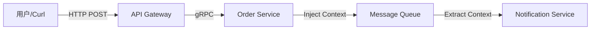

# Genesis Observability Demo

这是一个 **"全栈可观测性" (Full-Stack Observability)** 的演示项目，展示了如何在 Genesis 中打通 **Logging (日志)**、**Metrics (指标)** 和 **Tracing (链路追踪)** 三大支柱，并在 Grafana 中看到真实数据。

## 架构概览

本项目模拟了一个典型的微服务调用链路：



数据流转：
- **Trace**：HTTP -> gRPC -> MQ 全链路自动/手动透传 TraceID，数据上报到 **Tempo**。
- **Metrics**：应用暴露 `/metrics`，**Prometheus** 拉取，Grafana 展示。
- **Logs**：应用日志输出到 stdout，**Promtail** 采集后写入 **Loki**。

## 快速开始（推荐：一键 Docker Compose）

在仓库根目录执行：

```bash
cd examples/observability
docker compose up -d --build
```

服务启动后：
- **Gateway (HTTP)**: http://localhost:8080
- **gRPC**: localhost:9091 (映射容器 9090)
- **Prometheus**: http://localhost:9090
- **Grafana**: http://localhost:3000

> 提示：`docker compose ps` 可以查看所有服务是否健康启动。

## 产生真实数据

发送模拟下单请求：

```bash
curl -X POST http://localhost:8080/orders \
  -H "Content-Type: application/json" \
  -d '{"user_id":"1001", "product_id":"A001"}'
```

你会在容器日志中看到带有 `trace_id` 的输出。

## 如何验证

打开 **Grafana** (http://localhost:3000)：

### A. 指标（Metrics）
- 打开 **Dashboards**，选择预置的 **"Observability Demo App"**。
- 或直接在 Prometheus 查询：
  - `http_request_duration_seconds_bucket`
  - `mq_processing_duration_seconds_bucket`

### B. 链路（Tracing）
1. 进入 **Explore**。
2. 数据源选择 **Tempo**。
3. 输入日志中的 `trace_id` 或按 `service.name=observability-demo` 搜索。
4. 你会看到 Gateway -> gRPC -> MQ Consumer 的完整瀑布图。

### C. 日志（Logging）
1. 进入 **Explore**，数据源选择 **Loki**。
2. 查询：
   - `{job="docker", service="app"}`
   - 或 `{container="demo-app"}`

> 如果日志没有显示，请先确认 Promtail 是否运行：`docker compose ps`。在 Docker Desktop 上如遇日志读取权限问题，可先用 `docker logs demo-app` 验证日志输出。

## 目录结构

- `config/`: Prometheus / Loki / Tempo / Grafana / Promtail 的配置
- `proto/`: gRPC 定义及生成代码
- `docker-compose.yml`: 基础设施编排
- `main.go`: 核心演示代码 (Gateway + gRPC + MQ Consumer)
