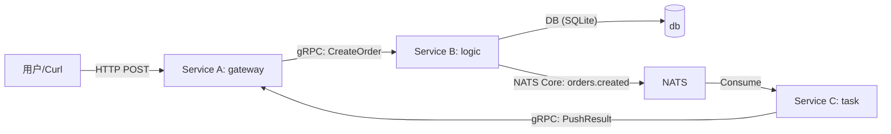

# Genesis Observability Demo

这是一个 **"全栈可观测性" (Full-Stack Observability)** 的演示项目，展示了如何在 Genesis 中打通 **Logging (日志)**、**Metrics (指标)** 和 **Tracing (链路追踪)** 三大支柱，并在 Grafana 中看到真实数据。

## 架构概览

本项目模拟一个“下单”业务的典型复杂链路（3 个服务 + MQ）：



数据流转：
- **Trace**：HTTP -> gRPC -> NATS -> gRPC 全链路透传 TraceContext（gRPC 自动、NATS 手动注入/提取），上报到 **Tempo**。
- **Metrics**：三服务分别暴露 `/metrics`，**Prometheus** 拉取，Grafana 展示。
- **Logs**：三服务日志输出到 stdout，**Promtail** 采集后写入 **Loki**。

## 快速开始（推荐：一键 Docker Compose）

在仓库根目录执行：

```bash
cd examples/observability
docker compose up -d --build
```

> 注意：本示例属于 Genesis 仓库的一部分，不是独立 Go Module，请不要在 `examples/observability` 下执行 `go mod init` / `go mod tidy`。

服务启动后：
- **Gateway (HTTP)**: http://localhost:8080
- **Gateway Callback (gRPC)**: localhost:9091
- **Logic (gRPC)**: localhost:9092
- **NATS**: localhost:4222
- **Prometheus**: http://localhost:9090
- **Grafana**: http://localhost:3000
- **Tempo (Ready)**: http://localhost:3200/ready（启动后前 ~15s 可能返回 503，随后变为 `ready`）

> 提示：`docker compose ps` 可以查看所有服务是否健康启动。

## 产生真实数据

发送模拟下单请求：

```bash
curl -X POST http://localhost:8080/orders \
  -H "Content-Type: application/json" \
  -H "Authorization: Bearer demo-token" \
  -d '{"user_id":"1001", "product_id":"A001"}'
```

你会在容器日志中看到三段关键输出（同一条 trace 下）：
- gateway 收到请求并转发到 logic
- logic 落库后发布 NATS 消息
- task 消费消息并通过 gRPC 把结果推回 gateway（到达 A 即算成功）

## 如何验证

打开 **Grafana** (http://localhost:3000)：

### A. 指标（Metrics）
- 打开 **Dashboards**，选择预置的 **"Observability Demo App"**。
- 或直接在 Prometheus 查询：
  - `http_request_duration_seconds_bucket`
  - `mq_handle_duration_seconds_bucket`

### B. 链路（Tracing）
1. 进入 **Explore**。
2. 数据源选择 **Tempo**。
3. 输入日志中的 `trace_id` 或按 `service.name=obs-gateway|obs-logic|obs-task` 搜索。
4. 你会看到 gateway -> logic -> NATS -> task -> gateway 的完整瀑布图。

### C. 日志（Logging）
1. 进入 **Explore**，数据源选择 **Loki**。
2. 查询：
   - `{job="docker", service=~"gateway|logic|task"}`
   - 或 `{container=~"demo-(gateway|logic|task)"}`

> 如果日志没有显示，请先确认 Promtail 是否运行：`docker compose ps`。在 Docker Desktop 上如遇日志读取权限问题，可先用 `docker logs demo-gateway` 验证日志输出。

## 目录结构

- `config/`: Prometheus / Loki / Tempo / Grafana / Promtail 的配置
- `proto/`: gRPC 定义及生成代码
- `docker-compose.yml`: 基础设施编排
- `cmd/gateway`: 服务 A（HTTP + gRPC 回调）
- `cmd/logic`: 服务 B（gRPC + SQLite + NATS Publish）
- `cmd/task`: 服务 C（NATS Consume + gRPC 回调）
