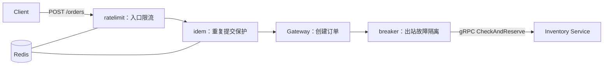

# Genesis Resilient Service 示例设计

> 状态：MVP 已实现。运行 `make example-resilient-service` 后，Gateway 监听
> `127.0.0.1:8083`，Inventory 以进程内 gRPC 服务启动。

本示例计划用一条最小的“创建订单”链路，展示 `ratelimit`、`idem` 和
`breaker` 如何在真实服务中协作。它不是新的全组件示例，也不重复
[`observability`](../observability/) 的 Grafana、Prometheus、Loki 和 Tempo
环境；这里关注的是请求入口保护、重复提交保护和下游故障隔离。

## 设计目标

- 展示治理组件在请求链路中的正确位置，而不只是分别调用一次 API。
- 同时覆盖常见的 HTTP 服务端和 gRPC 客户端调用。
- 可以主动制造突发流量、重复请求和下游故障，并观察稳定结果。
- 保持依赖和启动步骤足够少，方便作为业务服务模板阅读和改造。

## 场景与架构

用户通过 HTTP 创建订单，Gateway 在入口执行限流和幂等控制，然后通过
gRPC 调用 Inventory 检查库存。Inventory 的系统性失败由 Gateway 侧的熔断器
统计和隔离。



第一版计划只包含两个逻辑服务：

- **Gateway**：暴露 `POST /orders`，负责 HTTP 入口治理并调用下游。
- **Inventory**：暴露一元 gRPC 方法 `CheckAndReserve`，支持切换正常、业务拒绝和
  系统故障三种演示状态。

为了降低运行成本，两个服务由同一个示例程序启动在不同端口；它们仍通过真实 gRPC
连接通信。MVP 使用单机限流和内存幂等，因此不需要 Redis。

## 组件放置与顺序

### HTTP 服务端

建议的概念顺序如下：

```text
Recovery → Trace/Metrics → Auth（后续可选）→ RateLimit → Idempotency → Handler
```

- `ratelimit` 放在业务逻辑前，按调用方和路由组成稳定、低基数的 key；超过配额时
  返回 `429 Too Many Requests`。
- `idem` 放在限流之后，从 `X-Idempotency-Key` 读取客户端 key。首次成功响应被缓存，
  相同身份、相同请求和相同 key 的后续调用复用结果。
- 即使重复请求最终命中幂等缓存，它仍会消耗入口配额。这能避免攻击者通过固定幂等
  key 绕过流量保护。
- 如果后续加入 `auth`，认证必须先于 `idem`，由可信身份生成 identity scope；不能把
  未验证的 Header 直接作为租户或用户身份。

### gRPC 调用

- `breaker` 放在 Gateway 的 gRPC 客户端侧，保护对 Inventory 的出站调用。
- 超时由调用方通过 `context.WithTimeout` 控制；熔断器不替代超时和重试。
- `Unavailable`、`Internal` 等系统错误参与熔断统计；`InvalidArgument` 等业务错误不应
  触发熔断。
- 第一版按下游服务使用低基数 breaker key。只有实际出现方法间故障互相影响时，才
  演示拆分到方法级 key。

Inventory 服务端后续可以增加 `ratelimit.UnaryServerInterceptor`，用来说明 HTTP
入口限流和 RPC 服务端限流属于两层独立保护，但第一版不把它作为必选内容。

## 计划演示的行为

### 1. 正常创建

使用新的 `X-Idempotency-Key` 调用 `POST /orders`。Gateway 调用 Inventory 成功，返回
订单 ID，并缓存本次成功响应。

### 2. 重复提交

并发发送多次相同请求和相同幂等 key。客户端应收到一致的订单结果，实际业务处理
只发生一次。这个行为是应用层的“防重复成功提交”，不是数据库事务意义上的
exactly-once。

### 3. 入口限流

短时间发送超过 `Rate/Burst` 的请求。超额请求返回 `429`，但限流窗口恢复后可以继续
访问。示例应同时输出放行数和拒绝数，避免只靠日志判断结果。

### 4. 下游熔断与恢复

将 Inventory 切换为系统故障模式，使其持续返回 `Unavailable`。达到最小样本和失败率
后，Gateway 的 breaker 打开，后续调用不再真正到达 Inventory，而是快速返回 `503`。
冷却时间结束后，通过半开探测验证服务恢复。

### 5. 业务错误不触发熔断

Inventory 返回库存不足等业务拒绝。多次业务拒绝不应打开 breaker，用来说明“业务
失败”和“系统故障”必须使用不同的错误分类。

## 最小接口约定

### HTTP

```text
POST /orders
X-Idempotency-Key: <client-generated-key>

{
  "user_id": "u-1001",
  "product_id": "p-1001",
  "quantity": 1
}
```

成功响应应包含稳定的 `order_id`。限流、幂等校验失败、下游业务拒绝和下游不可用
应返回不同的状态码与错误码，避免客户端依赖错误文本。

### gRPC

```text
InventoryService.CheckAndReserve(CheckAndReserveRequest)
```

演示服务需要区分：

- 正常响应；
- 库存不足等业务错误；
- `Unavailable` 等系统错误；
- 恢复后的正常响应。

故障模式切换接口只服务于本地演示和自动验证，不作为生产接口设计参考。

## 验收标准

后续实现应提供一条自动验证命令，并至少检查：

1. 相同幂等 key 的并发请求只执行一次业务处理，且响应一致。
2. 突发请求中同时出现成功和 `429`，等待令牌恢复后再次成功。
3. 系统错误达到阈值后 breaker 打开，下游实际调用次数停止增长。
4. 冷却后半开探测成功，breaker 回到闭合状态。
5. 业务错误不会打开 breaker。

## 暂不纳入第一版

- 不重复搭建完整的可观测性后端；只保留必要日志和低成本验证计数。
- 不加入 DB、Cache、MQ、DLock 和服务注册，避免掩盖本示例的治理主题。
- 不演示无限重试。重试会放大下游压力，应在单独案例中说明预算、退避和幂等前提。
- 不宣称 `idem` 提供严格 exactly-once，也不把 breaker 当作业务错误处理器。

## 与其他示例的关系

- [`ratelimit`](../ratelimit/)：单独学习限流器和 Gin/gRPC 接入 API。
- [`idem`](../idem/)：单独学习 HTTP、gRPC 幂等和结果缓存语义。
- [`breaker`](../breaker/)：单独学习 gRPC 熔断状态机和 fallback。
- [`observability`](../observability/)：查看 HTTP、gRPC、DB、MQ 的日志、指标和 Trace
  完整链路。

本示例的职责是补上这些组件之间的组合关系，而不是替代各组件的独立示例。
